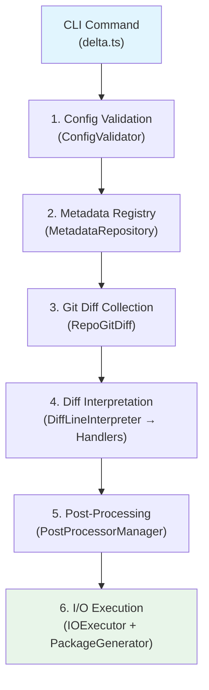
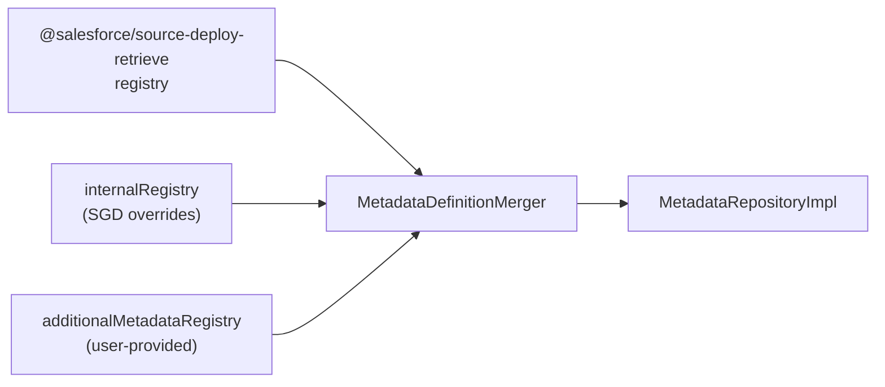
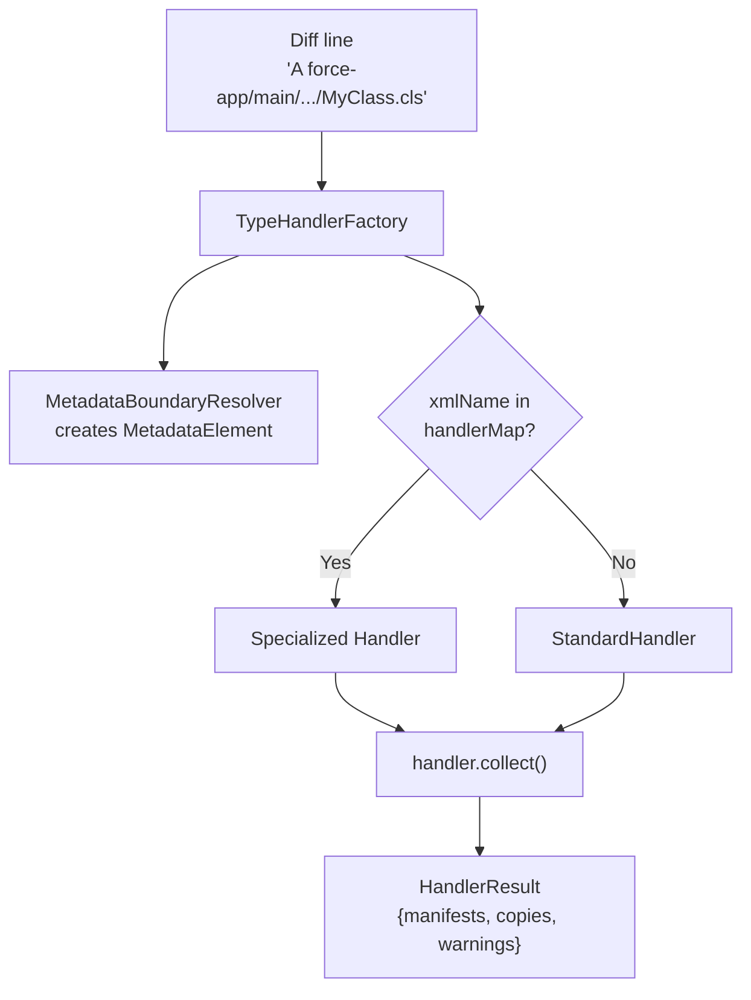
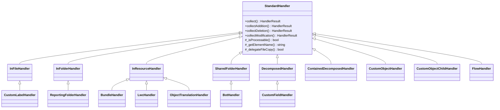
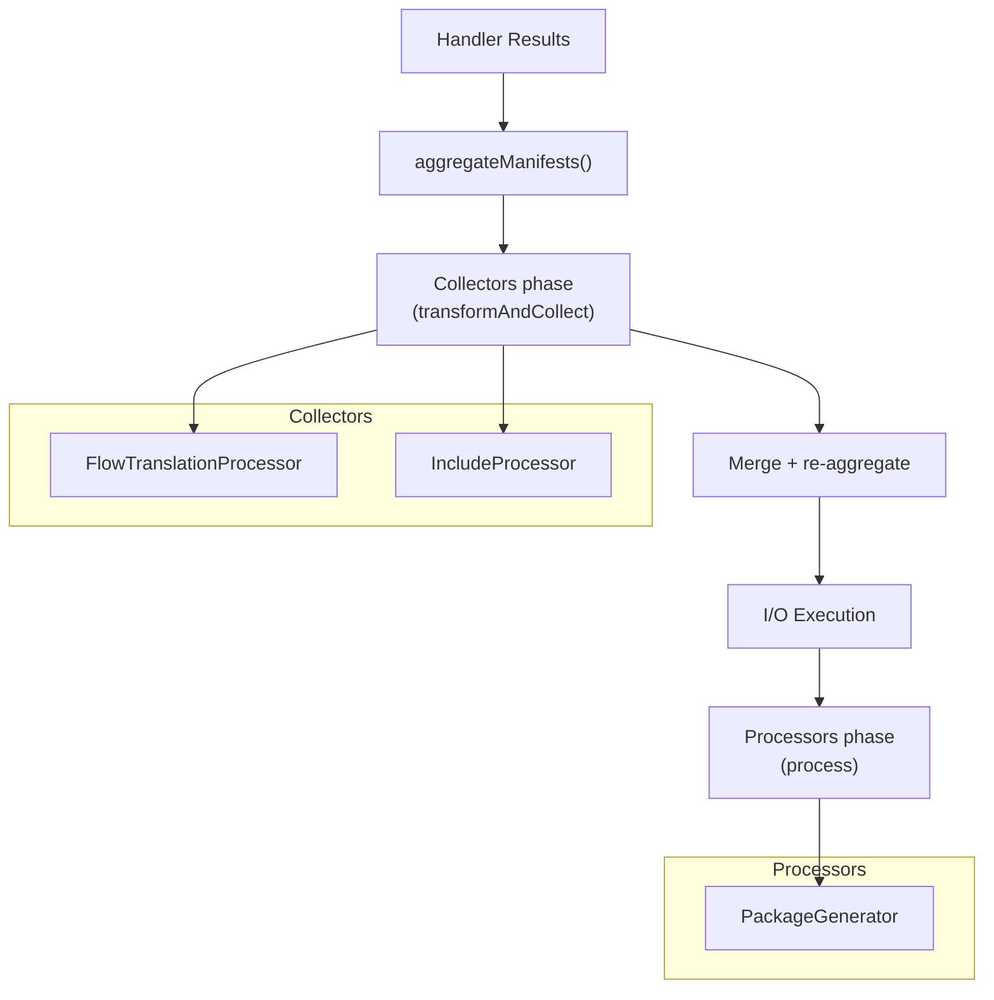

# SFDX-Git-Delta — Design Document

This document describes the internal architecture of SGD for contributors and maintainers. It follows the execution pipeline from CLI invocation to output generation.

## Pipeline Overview

SGD processes git diffs through a linear pipeline with six stages:



The pipeline is orchestrated by `src/main.ts`, which receives a `Config` object and returns a `Work` result containing the accumulated manifests and warnings.

Key design principle: **collection is separated from execution**. Handlers produce `HandlerResult` objects (manifest entries + copy operations) that are aggregated first, then written to disk only at the end. This allows deduplication and conflict resolution before any I/O occurs.

---

## Stage 1: Config Validation

**Entry**: `ConfigValidator.validateConfig()` (`src/utils/configValidator.ts`)

Validates and normalizes user inputs:

- Resolves symbolic git refs (`HEAD`, branch names) to full SHA via `git rev-parse`
- Validates that `from` and `to` SHAs exist in the repository
- Defaults `apiVersion` from `sfdx-project.json` or the latest SDR version; caps at the max supported version
- Sanitizes file paths (output dir, source dirs, ignore files)

Fatal errors (`ConfigError`) at this stage abort the pipeline entirely. This is one of only two places where exceptions propagate to the CLI layer.

---

## Stage 2: Metadata Registry

**Entry**: `getDefinition(config)` (`src/metadata/metadataManager.ts`)

Builds a `MetadataRepository` — the central lookup table mapping file paths to Salesforce metadata type definitions.

### Registry Priority Chain



1. **SDR registry** — standard Salesforce metadata types from `@salesforce/source-deploy-retrieve`, adapted via `SdrMetadataAdapter`
2. **Internal registry** (`src/metadata/internalRegistry.ts`) — SGD-specific overrides and additions (highest priority, overrides SDR by `xmlName`)
3. **Additional registry** (user-provided via `--additional-metadata-registry`) — custom types, lowest priority

### Multi-Index Lookup

`MetadataRepositoryImpl` maintains three lookup indexes for fast path resolution:

| Index | Key | Use case |
|-------|-----|----------|
| `extIndex` | File extension (`.cls`, `.trigger`) | Primary lookup for most types |
| `dirIndex` | Directory name (`classes`, `triggers`) | Fallback when extension is ambiguous |
| `xmlNameIndex` | XML name (`ApexClass`, `ApexTrigger`) | Direct lookup by type name |

### Key Metadata Fields

| Field | Purpose |
|-------|---------|
| `xmlName` | Salesforce API type name |
| `suffix` | File extension without dot |
| `directoryName` | Expected parent directory |
| `metaFile` | Whether a companion `-meta.xml` file exists |
| `inFolder` | Whether the type uses folder-based organization |
| `content[]` | Sub-types sharing the same directory (Dashboard → DashboardFolder) |
| `xmlTag` + `key` | In-file diff semantics for sub-element types |
| `pruneOnly` | Type is only ever added to destructiveChanges, never package |
| `excluded` | Sub-element type is not independently packageable |

---

## Stage 3: Git Diff Collection

**Entry**: `RepoGitDiff.getLines()` (`src/utils/repoGitDiff.ts`)

Collects diff lines between the `from` and `to` commits:

1. Runs `git diff --numstat --no-renames` for additions/modifications, and `git diff --numstat --no-renames --diff-filter=D` for deletions
2. Filters lines through the metadata registry — only paths that resolve to a known metadata type are kept
3. Applies ignore patterns (`IgnoreHelper`) — separate global and destructive-only ignore files
4. Detects renames: paths where the fully-qualified name (case-insensitive) appears in both the deletion and addition sets have their deletion suppressed — a rename manifests only as an addition

When `--ignore-whitespace` is enabled, `--word-diff-regex` and related flags are added to filter whitespace-only changes. The diff uses `--numstat` format so each line starts with a change type character (`A`, `M`, `D`).

### Ignore System

`IgnoreHelper` wraps the `ignore` library (gitignore spec) with a dual-instance pattern:

- **globalIgnore**: applied to all diff lines
- **destructiveIgnore**: applied only to deletions; falls back to globalIgnore if `--ignore-destructive-file` is not provided; always hard-codes `recordTypes/` (Salesforce API limitation)

---

## Stage 4: Diff Interpretation & Handler Hierarchy

**Entry**: `DiffLineInterpreter.process(lines)` (`src/service/diffLineInterpreter.ts`)

Each diff line is dispatched to a type-specific handler via an async queue capped at `getConcurrencyThreshold()`. The `TypeHandlerFactory` selects the handler class based on the metadata type's `xmlName`.

### Dispatch Flow



`MetadataBoundaryResolver` creates a `MetadataElement` — a value object capturing the parsed identity of the diff line: base path, extension, parent folder, component name, and path segments after the type directory. It may scan the git tree to find the component root when the directory name isn't present in the path.

### Handler Hierarchy



### StandardHandler — Template Method

`StandardHandler` defines the fixed algorithm skeleton:

1. `_isProcessable()` — gate: does this file match the expected suffix?
2. Switch on change type → `collectAddition()` / `collectDeletion()` / `collectModification()`
3. Errors are caught and converted to warnings — a single broken file does not abort processing

Subclasses override specific hooks to customize behavior. Even thin subclasses that override a single method justify their existence because they are selected at runtime based on metadata type definitions.

### Handler Reference

#### InFileHandler

**Extends**: StandardHandler
**Used by**: AssignmentRules, AutoResponseRules, EscalationRules, GlobalValueSetTranslation, MarketingAppExtension, MatchingRules, Profile, SharingRules, StandardValueSetTranslation, Translations, Workflow

Handles metadata types where multiple deployable sub-elements are stored in a single XML file. Uses `MetadataDiff` to compare both revisions of the file and produce per-sub-element manifest entries. Copies a pruned XML (computed content) containing only changed sub-elements instead of the full file.

Key behavior:
- Additions/modifications: XML diff produces fine-grained manifest entries per changed sub-element
- Deletions: if `pruneOnly` is set, treats as standard deletion; otherwise re-diffs to extract sub-element removals
- File copy: disabled for standard git-copy; uses computed content (pruned XML) instead

#### CustomLabelHandler

**Extends**: InFileHandler
**Used by**: CustomLabel

Handles `CustomLabel` which can exist in two formats:
- **Monolithic**: single `CustomLabels.labels-meta.xml` — uses InFile XML diff behavior
- **Decomposed**: individual `.label-meta.xml` files — uses StandardHandler behavior directly

Detects the format by file extension and routes accordingly.

#### InFolderHandler

**Extends**: StandardHandler
**Used by**: Document, EmailTemplate

Handles metadata stored in named folders. When a file changes, the handler also copies the folder's `-meta.xml` descriptor and any companion files sharing the same base name (e.g. thumbnails). Element names use the `Folder/MemberName` format.

#### ReportingFolderHandler

**Extends**: InFolderHandler
**Used by**: Dashboard, Report

Handles reporting types in shared directories where the actual Salesforce type is determined by file extension. An unrecognized extension silently produces an empty result. The manifest type name comes from the resolved extension, not the directory.

#### SharedFolderHandler

**Extends**: StandardHandler
**Used by**: VirtualDiscovery, VirtualModeration, VirtualWave

Handles metadata in a shared directory where the type is resolved per file extension. Similar to ReportingFolderHandler but without the folder-meta copy logic.

#### BotHandler

**Extends**: SharedFolderHandler
**Used by**: VirtualBot

Extends shared folder behavior: changing any sub-file also forces inclusion of the parent `Bot` manifest entry and its `.bot-meta.xml`.

#### InResourceHandler

**Extends**: StandardHandler
**Used by**: ExperienceBundle, GenAiPlannerBundle, LightningTypeBundle, StaticResource, WaveTemplateBundle

Handles bundle-like resources where changing any file within the bundle triggers the entire bundle to be redeployed. On deletion, checks if the bundle root still has content — if yes, treats as modification instead of deletion (the bundle still exists with remaining files).

#### BundleHandler

**Extends**: InResourceHandler
**Used by**: DigitalExperienceBundle

Like InResourceHandler but element names use two path segments (`bundleType/bundleName`) instead of one.

#### LwcHandler

**Extends**: InResourceHandler
**Used by**: AuraDefinitionBundle, GenAiFunction, LightningComponentBundle

Like InResourceHandler but skips files directly in the type directory (e.g. top-level `__tests__`); only processes files inside a named component sub-folder.

#### ObjectTranslationHandler

**Extends**: InResourceHandler
**Used by**: CustomFieldTranslation, CustomObjectTranslation

Field translation files are not independently deployable. The handler produces a pruned version of the parent `objectTranslation` file containing only changed field translations, emitted as computed content.

#### DecomposedHandler

**Extends**: StandardHandler
**Used by**: SharingCriteriaRule, SharingGuestRule, SharingOwnerRule, Territory2, Territory2Rule, WorkflowAlert, WorkflowFieldUpdate, WorkflowFlowAction, WorkflowKnowledgePublish, WorkflowOutboundMessage, WorkflowRule, WorkflowSend, WorkflowTask

Handles metadata stored as individual files in sub-folders of a parent type. Element names are qualified as `ParentName.ChildName`. On addition, also copies the parent type's `-meta.xml`.

#### CustomFieldHandler

**Extends**: DecomposedHandler
**Used by**: CustomField

Like DecomposedHandler but the parent copy is conditional: only copies the parent `CustomObject` when the field contains `<type>MasterDetail</type>`, because Master Detail fields require the parent object in the same deployment.

#### ContainedDecomposedHandler

**Extends**: StandardHandler
**Used by**: PermissionSet

Handles types that can exist in either monolithic format (single file) or decomposed format (folder with sub-files). Detects the format at construction time. On deletion in decomposed format, checks if the holder folder still has content before treating as a true deletion.

#### CustomObjectHandler

**Extends**: StandardHandler
**Used by**: CustomObject, Territory2Model

On addition, scans the object's `fields/` subfolder for Master Detail fields and includes them in the copy set — Master Detail fields cannot be deployed in a subsequent step.

#### CustomObjectChildHandler

**Extends**: StandardHandler
**Used by**: BusinessProcess, CompactLayout, FieldSet, Index, ListView, RecordType, SharingReason, ValidationRule, WebLink

Handles child types living in CustomObject sub-folders. Element names are qualified as `ObjectName.ChildName`.

#### FlowHandler

**Extends**: StandardHandler
**Used by**: Flow

Standard behavior plus a warning on deletion — deleting a Flow requires manual deactivation first (Salesforce API limitation).

---

## Stage 5: Post-Processing Chain

**Entry**: `PostProcessorManager` (`src/post-processor/postProcessorManager.ts`)

After handlers produce their results, post-processors run in two phases:



### Two-Phase Execution

**Collectors** (`isCollector = true`) run first via `collectAll()`. They produce additional `HandlerResult` data that gets merged into the main result:

- **FlowTranslationProcessor**: when Flows are being deployed, scans all `.translation-meta.xml` files in the repo for `flowDefinitions` elements matching deployed flows. Produces pruned translation files as computed content.
- **IncludeProcessor**: handles `--include` and `--include-destructive` flags. Lists all files in source directories, filters through include patterns, then processes matching lines through `DiffLineInterpreter` as synthetic additions/deletions.

**Processors** (`isCollector = false`) run last via `executeRemaining()`:

- **PackageGenerator**: the final step. Deduplicates manifests (removes entries from `destructiveChanges` that also appear in `package`), then writes `package.xml`, `destructiveChanges.xml`, and the required companion empty `package.xml` for destructive deployments.

Each processor is wrapped in error isolation — failures produce warnings rather than crashing the pipeline.

---

## Stage 6: I/O Execution

**Entry**: `IOExecutor.execute(copies)` (`src/service/ioExecutor.ts`)

Executes the accumulated copy operations with concurrency bounded by `getConcurrencyThreshold()`. Two operation kinds:

| Kind | Description |
|------|-------------|
| `GitCopy` | Reads a file from a specific git revision via `git show <rev>:<path>` and writes it to the output directory |
| `ComputedContent` | Writes a string (typically pruned XML from InFile/ObjectTranslation handlers) directly to the output directory |

`GitAdapter.getBufferContent()` handles LFS detection: if the buffer starts with an LFS pointer signature, it reads the actual object from the local LFS cache instead.

---

## Cross-Cutting Concerns

### Error Handling

SGD follows a **warnings-not-exceptions** philosophy for per-file errors:

| Layer | Strategy |
|-------|----------|
| Config validation | Fatal: throws `ConfigError` / `MetadataRegistryError` → propagates to CLI |
| Handlers (`collect()`) | Catches all errors → converts to warnings in `HandlerResult` |
| Post-processors | Each wrapped in `_safeProcess` → failures become warnings |
| Git operations | Debug-logged, return empty/false → silent degradation |
| XML parsing | Produces "MalformedXML" warning with file path and revision |

This ensures a single broken file never aborts processing of the entire diff.

Error types form a hierarchy:
- `SgdError` (base) — wraps original error as `cause`
- `ConfigError` — invalid user configuration
- `MetadataRegistryError` — invalid additional metadata registry

### Concurrency

Every parallel operation uses `getConcurrencyThreshold()` from `src/utils/concurrencyUtils.ts`, which returns `min(availableParallelism(), 6)`. The cap at 6 is a deliberate CI/CD safety constraint — the plugin runs on small CI machines.

The `async` library's `queue`, `eachLimit`, `mapLimit`, and `filterLimit` are used throughout. Unbounded `Promise.all` is never used for file or git operations.

### Logging

Two complementary mechanisms:

**`lazy` template tag** (`src/utils/LoggingService.ts`): defers string interpolation until the log level is active. Expressions are evaluated eagerly by JavaScript, so expensive computations must be wrapped as arrow functions:

```typescript
Logger.debug(lazy`result: ${() => JSON.stringify(largeObject)}`)
```

**`@log` decorator** (`src/utils/LoggingDecorator.ts`): emits `Logger.trace` entry/exit on decorated methods. Works for both sync and async functions. Applied pervasively across handlers, adapters, and processors.

### Git Adapter

`GitAdapter` (`src/adapter/GitAdapter.ts`) wraps `simple-git` with a singleton pattern keyed by `Config` identity. It caches `pathExists` and `ls-tree` results per instance to avoid redundant git operations.

---

## Extensibility Points

### For Users

| Mechanism | Purpose |
|-----------|---------|
| `--additional-metadata-registry` | JSON file defining custom metadata types (Zod-validated) |
| `--ignore-file` / `--ignore-destructive-file` | Gitignore-format exclusion patterns |
| `--include-file` / `--include-destructive-file` | Force-include paths regardless of diff |
| `--source-dir` (multiple) | Scope diff to specific directories |

### For Developers

| Extension point | How to extend |
|-----------------|---------------|
| New metadata type handler | Add entry to `handlerMap` in `TypeHandlerFactory` mapping `xmlName → HandlerClass` |
| New post-processor | Add a `BaseProcessor` subclass to `registeredProcessors` in `postProcessorManager.ts` |
| Metadata type override | Add definition to `internalRegistry.ts` with special flags (`pruneOnly`, `excluded`, `xmlTag`, etc.) |
| Programmatic API | `import sgd from 'sfdx-git-delta'` — call `await sgd(config)` directly, receiving the `Work` object |

---

## Key Types Reference

### Config (`src/types/config.ts`)

All user inputs flowing through the pipeline:

| Field | Type | Description |
|-------|------|-------------|
| `from` / `to` | `string` | Git commit SHAs (the diff range) |
| `output` | `string` | Directory for generated manifests |
| `source` | `string[]` | Source paths to scan |
| `repo` | `string` | Git repository root |
| `apiVersion` | `number` | Salesforce API version |
| `generateDelta` | `boolean` | Whether to copy files (not just manifests) |
| `ignore` / `ignoreDestructive` | `string` | Gitignore-style filter file paths |
| `include` / `includeDestructive` | `string` | Force-include file paths |
| `ignoreWhitespace` | `boolean` | Skip whitespace-only changes |

### Work (`src/types/work.ts`)

Mutable context accumulating outputs:

| Field | Type | Description |
|-------|------|-------------|
| `config` | `Config` | The configuration |
| `diffs` | `{ package: Map, destructiveChanges: Map }` | Accumulated manifest maps (`type → Set<member>`) |
| `warnings` | `Error[]` | Non-fatal warnings |

### HandlerResult (`src/types/handlerResult.ts`)

Universal handler/processor output:

| Field | Type | Description |
|-------|------|-------------|
| `manifests` | `ManifestElement[]` | Entries for package.xml or destructiveChanges.xml |
| `copies` | `CopyOperation[]` | `GitCopy` or `ComputedContent` operations |
| `warnings` | `Error[]` | Non-fatal warnings |

### Metadata (`src/schemas/metadata.ts`)

Metadata type definition (Zod-validated):

| Field | Type | Description |
|-------|------|-------------|
| `xmlName` | `string` | Salesforce API type name |
| `suffix` | `string` | File extension without dot |
| `directoryName` | `string` | Expected parent directory |
| `metaFile` | `boolean` | Companion `-meta.xml` exists |
| `inFolder` | `boolean` | Folder-based organization |
| `content` | `Metadata[]` | Sub-types sharing the directory |
| `xmlTag` + `key` | `string` | In-file diff semantics |
| `pruneOnly` | `boolean` | Only in destructiveChanges |
| `excluded` | `boolean` | Not independently packageable |
