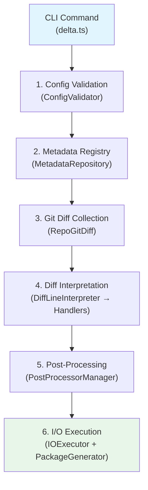
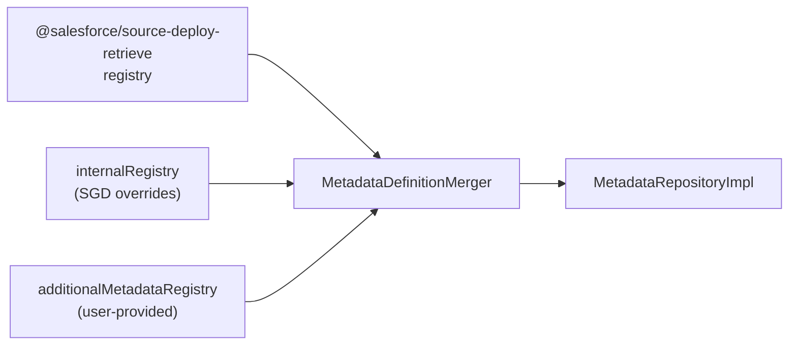
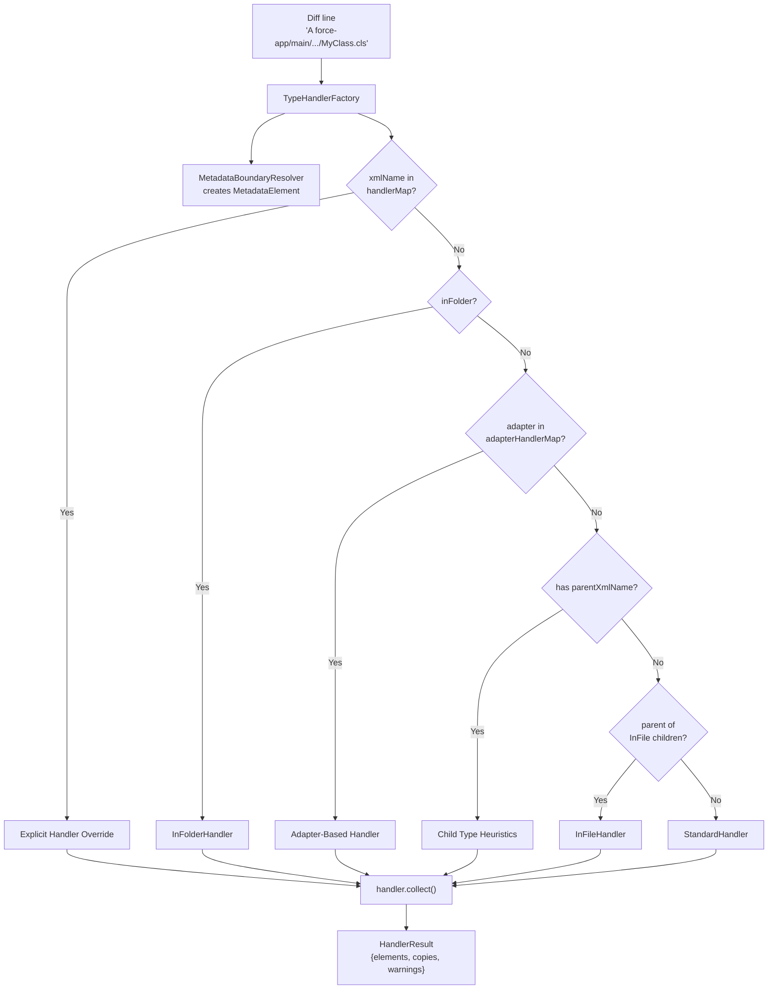
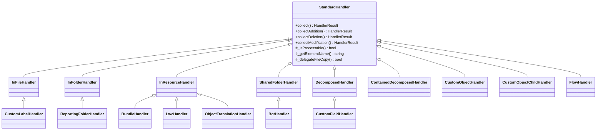
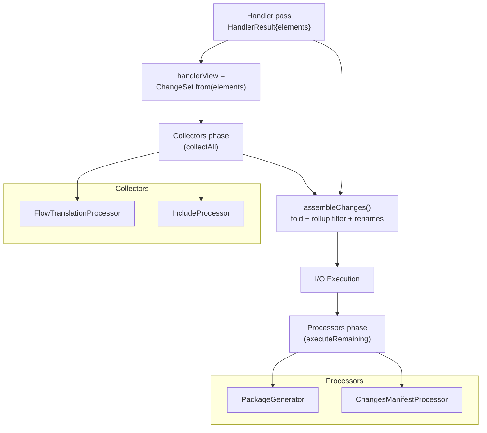

# SFDX-Git-Delta — Design Document

This document describes the internal architecture of SGD for contributors and maintainers. It follows the execution pipeline from CLI invocation to output generation.

## Pipeline Overview

SGD processes git diffs through a linear pipeline with six stages:


```mermaid
flowchart TD
    CLI["CLI Command<br/>(delta.ts)"] --> V["1. Config Validation<br/>(ConfigValidator)"]
    V --> M["2. Metadata Registry<br/>(MetadataRepository)"]
    M --> G["3. Git Diff Collection<br/>(RepoGitDiff)"]
    G --> I["4. Diff Interpretation<br/>(DiffLineInterpreter → Handlers)"]
    I --> P["5. Post-Processing<br/>(PostProcessorManager)"]
    P --> IO["6. I/O Execution<br/>(IOExecutor + PackageGenerator)"]

    style CLI fill:#e1f5fe
    style IO fill:#e8f5e9
```

The pipeline is orchestrated by `src/main.ts`, which receives a `Config` object and returns a `Work` result containing the folded manifests and warnings.

Key design principle: **collection is separated from execution, and handlers are pure**. Each handler's `collect()` is a function of its `(changeType, element, config)` construction inputs alone: it returns a flat `HandlerResult` (`elements`, `copies`, `warnings`) and holds no reference to anything another handler or the orchestrator can see. `DiffLineInterpreter.process()` owns the only accumulator — it folds every handler's returned elements into three orchestrator-local arrays as handlers complete, then hands the folded result to `assembleChanges()` (`src/utils/changesAssembly.ts`), which builds the single `ChangeSet` read model the rest of the pipeline consumes. Nothing is written to disk until `IOExecutor` runs at stage 6, after collectors have folded their own contributions in. This separation enables deduplication and conflict resolution before any I/O occurs, and lets the diff stream be consumed as it arrives from git rather than buffered up front — `RepoGitDiff.getLines()` returns an `AsyncGenerator<string>` that handlers begin draining while git is still emitting.

---

## Stage 1: Config Validation

**Entry**: `ConfigValidator.validateConfig()` (`src/utils/configValidator.ts`)

Validates and normalizes user inputs:

- Resolves symbolic git refs (`HEAD`, branch names) to full SHA via `git rev-parse`
- Validates that `from` and `to` SHAs exist in the repository
- Defaults `apiVersion` from `sfdx-project.json` or the latest SDR version; caps at the max supported version. The latest-version lookup is a live call to the appexchange org: when it is unreachable (offline/firewalled) a provided `apiVersion` is kept as-is, otherwise a `ConfigError` advises supplying one
- Sanitizes file paths (output dir, source dirs, ignore files)

Fatal errors (`ConfigError`) at this stage abort the pipeline entirely. This is one of only two places where exceptions propagate to the CLI layer.

---

## Stage 2: Metadata Registry

**Entry**: `getDefinition(config)` (`src/metadata/metadataManager.ts`)

Builds a `MetadataRepository` — the central lookup table mapping file paths to Salesforce metadata type definitions.

### Registry Priority Chain


```mermaid
flowchart LR
    SDR["@salesforce/source-deploy-retrieve<br/>registry"] --> Merge["MetadataDefinitionMerger"]
    IR["internalRegistry<br/>(SGD overrides)"] --> Merge
    AR["additionalMetadataRegistry<br/>(user-provided)"] --> Merge
    Merge --> Repo["MetadataRepositoryImpl"]
```

1. **SDR registry** — standard Salesforce metadata types from `@salesforce/source-deploy-retrieve`, adapted via `SdrMetadataAdapter`
2. **Internal registry** (`src/metadata/internalRegistry.ts`) — SGD-specific overrides and additions (highest priority, overrides SDR by `xmlName`)
3. **Additional registry** (user-provided via `--additional-metadata-registry`) — custom types, lowest priority

### Multi-Index Lookup

`MetadataRepositoryImpl` maintains three lookup indexes for fast path resolution:

| Index | Key | Use case |
| ----- | --- | -------- |
| `extIndex` | File extension (`.cls`, `.trigger`) | Primary lookup for most types |
| `dirIndex` | Directory name (`classes`, `triggers`) | Fallback when extension is ambiguous — picks deepest match, stops at `inFolder` types, SDR content-container adapters (`bundle`/`digitalExperience`/`mixedContent`), and virtual content-containers (internal-registry types with `metaFile: true` and a non-empty `content[]`: Wave/Bot/Discovery/Moderation) so a nested content folder colliding with a metadata directory name (e.g. an `icons/` folder inside a StaticResource, or a `dashboards/` folder inside `wave/`) cannot override the container type |
| `xmlNameIndex` | XML name (`ApexClass`, `ApexTrigger`) | Direct lookup by type name, exposed as `getByXmlName(xmlName)` on the interface for handler-resolution and parent-type lookup |

### Key Metadata Fields

| Field | Purpose |
| ----- | ------- |
| `xmlName` | Salesforce API type name |
| `suffix` | File extension without dot |
| `directoryName` | Expected parent directory |
| `metaFile` | Whether a companion `-meta.xml` file exists |
| `inFolder` | Whether the type uses folder-based organization |
| `content[]` | Sub-types sharing the same directory (Dashboard → DashboardFolder) |
| `xmlTag` + `key` | In-file diff semantics for sub-element types |
| `adapter` | SDR `strategies.adapter` value (e.g. `bundle`, `mixedContent`, `digitalExperience`) — drives dynamic handler resolution |
| `decomposition` | SDR `strategies.decomposition` value (e.g. `folderPerType`) — used for child type handler heuristics |
| `pruneOnly` | Type is only ever added to destructiveChanges, never package |
| `excluded` | Sub-element type is not independently packageable |

---

## Stage 3: Git Diff Collection

**Entry**: `RepoGitDiff.getLines()` (`src/utils/repoGitDiff.ts`)

Streams diff lines between the `from` and `to` commits. `getLines()` is an `AsyncGenerator<string>` so RepoGitDiff never buffers the diff into an array. `GitAdapter.streamDiffLines()` is the upstream producer: it makes a single `repo.diff({ from, to, recursive: true, detectRenames, ... })` call against the tsgit facade, then yields sgd's `<STATUS>\t<path>` line shape by iterating the returned `DiffChange[]` through `toDiffLines()`. Rename detection (`detectRenames`) is **gated on `config.changesManifest`** — default sgd runs pass `detectRenames: false` so line shape matches the pre-feature output; setting `--changes-manifest` turns it on. When enabled, `toDiffLines()` yields `R<score>\tfrom\tto` for a rename with both sides in scope (score from `toSimilarityPercent`), degrading to a plain `A` or `D` line when only one side is in scope; `RepoGitDiff._expandRename` then splits `R` lines into synthetic `A`/`D` pairs while recording each `{fromPath, toPath}` pair for `RenameResolver` to resolve later.

`toDiffLines()` replicates the subprocess-era `--diff-filter=AMD(R)` scoping in one pass over each `DiffChange`: gitlink (submodule pointer) changes are skipped via `keepSide`, and `type-change`/`copy` entries are dropped. Whitespace-only changes are excluded by passing `ignoreWhitespace: 'all'` / `ignoreBlankLines: true` diff-mode options to `repo.diff()` when `config.ignoreWhitespace` is set — one facade call covers both the default and whitespace-ignoring cases; there is no separate code path, no per-filter round trip, and no numstat/`-z` rename-path encoding to parse, since `DiffChange` already carries typed `oldPath`/`newPath` fields.

Per upstream line, `getLines()` then:

1. Expands rename lines into synthetic `A`/`D` pairs (capturing the rename-pair side-channel).
2. Filters through the metadata registry — only paths that resolve to a known metadata type are yielded.
3. Applies ignore patterns (`IgnoreHelper`) — separate global and destructive-only ignore files.
4. **Defers `D` lines until upstream EOF** so the deleted-renamed cancellation rule has the full A-name set. A/M lines yield as they arrive; D lines are buffered and yielded last, dropping any whose comparison name matches an addition (the legacy file-move-same-component safety net — different file paths resolving to the same Salesforce component). True component renames (different FQNs) surface via tsgit's `detectRenames`.

When the orchestrator (`src/main.ts`) needs to also compute the tree-index scope (`generateDelta` on, no `--include`), it materializes the stream once into an array because both `computeTreeIndexScope` and `lineProcessor.process` need to walk the same lines; otherwise the async iterable feeds straight into the handler queue.

### Ignore System

`IgnoreHelper` wraps the `ignore` library (gitignore spec) with a dual-instance pattern:

- **globalIgnore**: applied to all diff lines
- **destructiveIgnore**: applied only to deletions; falls back to globalIgnore if `--ignore-destructive-file` is not provided; always hard-codes `recordTypes/` (Salesforce API limitation)

---

## Stage 4: Diff Interpretation & Handler Hierarchy

**Entry**: `DiffLineInterpreter.process(lines)` (`src/service/diffLineInterpreter.ts`)

Each diff line is dispatched to a type-specific handler via an async queue capped at `getConcurrencyThreshold()`. The `TypeHandlerFactory` selects the handler class using a multi-tier resolution chain that combines explicit overrides with dynamic resolution from SDR registry attributes.

### Dispatch Flow


```mermaid
flowchart TD
    Line["Diff line<br/>'A force-app/main/.../MyClass.cls'"] --> TF["TypeHandlerFactory"]
    TF --> ME["MetadataBoundaryResolver<br/>creates MetadataElement"]
    TF --> T1{"xmlName in<br/>handlerMap?"}
    T1 -->|Yes| SH["Explicit Handler Override"]
    T1 -->|No| T2{"inFolder?"}
    T2 -->|Yes| IF["InFolderHandler"]
    T2 -->|No| T3{"adapter in<br/>adapterHandlerMap?"}
    T3 -->|Yes| AH["Adapter-Based Handler"]
    T3 -->|No| T4{"has parentXmlName?"}
    T4 -->|Yes| CH["Child Type Heuristics"]
    T4 -->|No| T5{"parent of<br/>InFile children?"}
    T5 -->|Yes| IFH["InFileHandler"]
    T5 -->|No| DH["StandardHandler"]
    CH --> C["handler.collect()"]
    SH --> C
    IF --> C
    AH --> C
    IFH --> C
    DH --> C
    C --> HR["HandlerResult<br/>{elements, copies, warnings}"]
```

`DiffLineInterpreter.process()` allocates no shared state up front. Each handler's `collect()` takes no parameter and returns a `HandlerResult` describing only what that handler contributed. The `BoundedQueue` worker folds every returned `elements` / `copies` / `warnings` triple into three orchestrator-owned local arrays via `pushAll` as each handler completes — up to `MAX_PARALLELISM` handlers write concurrently, but each write is a plain array push, so there is no shared object a handler can corrupt. This fold step must itself never throw: `BoundedQueue` treats a worker rejection as fatal to the whole pass, so aggregation is total, side-effect-free array work over results handlers have already caught internally. `process()` returns the folded arrays as one `HandlerResult`.

### Handler Resolution Tiers

The `resolveHandler()` method applies these tiers in order, returning the first match:

| Tier | Signal | Handler | Example |
| ---- | ------ | ------- | ------- |
| 1. Explicit override | `xmlName` in `handlerMap` | Varies | `Flow` → `FlowHandler` |
| 2. Folder-based | `inFolder: true` | `InFolderHandler` | `Document`, `EmailTemplate` |
| 3. Adapter-based | `adapter` from SDR strategies | `InResourceHandler` / `InBundleHandler` | `bundle` → `InResource` |
| 4. Child heuristics | `xmlTag` + `key` + non-adapter parent | `DecomposedHandler` | `WorkflowAlert` |
| 4b. Child heuristics | no `xmlTag` + `folderPerType` parent | `CustomObjectChildHandler` | `ListView` |
| 5. InFile parent | has children with `xmlTag`+`key` | `InFileHandler` | `Workflow` |
| 6. Fallback | none of the above | `StandardHandler` | `ApexClass` |

This design means most new SDR metadata types are handled automatically without code changes. Only types requiring specialized behavior need explicit overrides in `handlerMap`.

`MetadataBoundaryResolver` creates a `MetadataElement` — a value object capturing the parsed identity of the diff line: base path, extension, parent folder, component name, and path segments after the type directory. Resolution follows a tiered strategy to minimize git I/O: (1) flat paths (single segment after the type directory) use `MetadataElement.fromPath()` directly; (2) types with no suffix (LWC, Aura) use `fromPath()` since the scan cannot identify them; (3) depth-2 paths where the file contains the metadata suffix extract the component name directly from the file name without git I/O; (4) deeper paths delegate to `scanAndCreateElement()` which calls `getFilesPath(typeDir)` — served from the in-memory tree index (`TreeIndex`, built once per revision via `preBuildTreeIndex`/`flattenTree`; see "Git Adapter" below), so the lookup makes zero additional git invocations — then builds a Set of component names from meta files and matches path segments inner-to-outer. This handles intermediate folders between the type directory and the component (e.g., `permissionsets/marketing/Admin/...` where `marketing` is an organizational folder, not the component). For paths where the type directory is not in the path, a fallback walk-up strategy lists directory siblings via `listDirAtRevision` and matches against known metadata suffixes, with results cached per revision via `dirCache`.

### Handler Hierarchy


```mermaid
classDiagram
    class StandardHandler {
        +collect() HandlerResult
        +collectAddition() HandlerResult
        +collectDeletion() HandlerResult
        +collectModification() HandlerResult
        #_isProcessable() bool
        #_getElementName() string
        #_delegateFileCopy() bool
    }

    StandardHandler <|-- InFileHandler
    StandardHandler <|-- InFolderHandler
    StandardHandler <|-- InResourceHandler
    StandardHandler <|-- SharedFolderHandler
    StandardHandler <|-- DecomposedHandler
    StandardHandler <|-- ContainedDecomposedHandler
    StandardHandler <|-- CustomObjectHandler
    StandardHandler <|-- CustomObjectChildHandler
    StandardHandler <|-- FlowHandler

    InFileHandler <|-- CustomLabelHandler
    InFolderHandler <|-- ReportingFolderHandler
    InResourceHandler <|-- BundleHandler
    InResourceHandler <|-- LwcHandler
    InResourceHandler <|-- ObjectTranslationHandler
    SharedFolderHandler <|-- BotHandler
    DecomposedHandler <|-- CustomFieldHandler
```

### StandardHandler — Template Method

`StandardHandler` defines the fixed algorithm skeleton:

1. `_isProcessable()` — gate: does this file match the expected suffix?
2. Switch on change type → `collectAddition()` / `collectDeletion()` / `collectModification()`
3. Errors are caught and converted to warnings — a single broken file does not abort processing

Every hook is a pure function of the handler's constructor inputs (`changeType`, `element`, `config`): calling `collect()` twice on the same inputs returns deep-equal results and touches nothing outside the handler instance. A few subclasses set instance-local scratch fields during construction or inside a single `collect()` call (e.g. `InResourceHandler.metadataName`, `ContainedDecomposedHandler.holderFolder`) — that stays single-owner state, not shared state, because a fresh handler instance is created per diff line and `collect()`ed exactly once.

Subclasses override specific hooks to customize behavior. Even thin subclasses that override a single method justify their existence because they are selected at runtime based on metadata type definitions.

### Handler Reference

#### InFileHandler

**Extends**: StandardHandler
**Used by**: AssignmentRules, AutoResponseRules, EscalationRules, GlobalValueSetTranslation, MarketingAppExtension, MatchingRules, Profile, SharingRules, StandardValueSetTranslation, Translations, Workflow

Handles metadata types where multiple deployable sub-elements are stored in a single XML file. Uses `MetadataDiff` to compare both revisions of the file and produce per-sub-element manifest entries. Copies a pruned XML (computed content) containing only changed sub-elements instead of the full file.

Key behavior:
- Additions/modifications: XML diff produces fine-grained manifest entries per changed sub-element
- Deletions: if `pruneOnly` is set, treats as standard deletion; otherwise re-diffs to extract sub-element removals
- File copy: disabled for standard git-copy; uses computed content (pruned XML) instead
- Container manifest entry: the container is listed in `package.xml` only when the to-side has a surviving add or modify in any bucket — including registry-excluded children and scalar/unknown tags, neither of which produce their own manifest entry. A diff whose only change is removed keyed or object-fingerprint children lists nothing in `package.xml` and emits no delta file; it produces `destructiveChanges.xml` entries only for children that are not registry-excluded. Whole-bucket subTypes (array/keyless/unknown) are compared wholesale, so removing an element there counts as a modify of the container: it lists the container, emits a pruned delta file and produces no destructive entry

#### CustomLabelHandler

**Extends**: InFileHandler
**Used by**: CustomLabel

Handles `CustomLabel` which can exist in two formats:
- **Monolithic**: single `CustomLabels.labels-meta.xml` — uses InFile XML diff behavior
- **Decomposed**: individual `.label-meta.xml` files — uses StandardHandler behavior directly

Detects the format by file extension and routes accordingly.

#### InFolderHandler

**Extends**: StandardHandler
**Used by**: Document, EmailTemplate (and any type with `inFolder: true` not explicitly overridden)

Handles metadata stored in named folders. When a file changes, the handler also copies the folder's `-meta.xml` descriptor and any companion files sharing the same base name (e.g. thumbnails). Element names use the `Folder/MemberName` format.

#### ReportingFolderHandler

**Extends**: InFolderHandler
**Used by**: Dashboard, Report

Handles reporting types in shared directories where the actual Salesforce type is determined by file extension. An unrecognized extension silently produces an empty result. The manifest type name comes from the resolved extension, not the directory.

#### SharedFolderHandler

**Extends**: StandardHandler
**Used by**: VirtualDiscovery, VirtualModeration, VirtualWave

Handles metadata in a shared directory where the type is resolved per file extension. Similar to ReportingFolderHandler but without the folder-meta copy logic.

#### BotHandler

**Extends**: SharedFolderHandler
**Used by**: VirtualBot

Extends shared folder behavior: changing any sub-file also forces inclusion of the parent `Bot` manifest entry and its `.bot-meta.xml`.

#### InResourceHandler

**Extends**: StandardHandler
**Used by**: ExperienceBundle, GenAiPlannerBundle, LightningTypeBundle, StaticResource, WaveTemplateBundle (and any type with `adapter: "bundle"` or `adapter: "mixedContent"` not explicitly overridden)

Handles bundle-like resources where changing any file within the bundle triggers the entire bundle to be redeployed. On deletion, checks if the bundle root still has content — if yes, treats as modification instead of deletion (the bundle still exists with remaining files).

#### BundleHandler

**Extends**: InResourceHandler
**Used by**: DigitalExperienceBundle

Like InResourceHandler but element names use two path segments (`bundleType/bundleName`) instead of one.

For a **page-level** change — a content file inside the canonical
`<baseType>/<spaceApiName>/<contentType>/<contentApiName>/...` layout (more than four path segments
after the `digitalExperiences` directory) — it instead emits the fine-grained `DigitalExperience`
child type (`<baseType>/<spaceApiName>.<contentType>/<contentApiName>`) and scopes the component to
the content folder. The delete-vs-modify existence check then covers only that page, and the file
copy ships the full content folder recursively — all core files (`_meta.json`, `content.json`),
nested device-variant subfolders (`mobile/`, `tablet/`), and any locale/media files — scoped to the
single content folder. A `DigitalExperience` view deploy replaces the view's full device-version
set, so absent variant folders would read as deletions and be rejected; the delta must therefore
carry the whole folder. Shorter paths (the bundle's own `*.digitalExperience-meta.xml`, or any
non-canonical shallow path) keep the coarse `DigitalExperienceBundle` behaviour. Whole-bundle
add/delete is collapsed back to a single `DigitalExperienceBundle` member by the bundle-rollup filter
applied during assembly (see Stage 5).

#### LwcHandler

**Extends**: InResourceHandler
**Used by**: AuraDefinitionBundle, GenAiFunction, LightningComponentBundle

Like InResourceHandler but skips files directly in the type directory (e.g. top-level `__tests__`); only processes files inside a named component sub-folder.

#### ObjectTranslationHandler

**Extends**: InResourceHandler
**Used by**: CustomFieldTranslation, CustomObjectTranslation

Field translation files are not independently deployable, so the parent `objectTranslation` file must always accompany its field-translation children in the output. When the parent has its own surviving changes, the handler emits a pruned version containing only the changed field translations as computed content; when it has none (a child-only change), it falls back to copying the whole parent file verbatim at the target revision.

#### DecomposedHandler

**Extends**: StandardHandler
**Used by**: SharingCriteriaRule, SharingGuestRule, SharingOwnerRule, Territory2, Territory2Rule, WorkflowAlert, WorkflowFieldUpdate, WorkflowFlowAction, WorkflowKnowledgePublish, WorkflowOutboundMessage, WorkflowRule, WorkflowSend, WorkflowTask (and any child type with `xmlTag` + `key` whose parent has no adapter)

Handles metadata stored as individual files in sub-folders of a parent type. Element names are qualified as `ParentName.ChildName`. On addition, also copies the parent type's `-meta.xml`.

#### CustomFieldHandler

**Extends**: DecomposedHandler
**Used by**: CustomField

Like DecomposedHandler but the parent copy is conditional: only copies the parent `CustomObject` when the field contains `<type>MasterDetail</type>`, because Master Detail fields require the parent object in the same deployment.

#### ContainedDecomposedHandler

**Extends**: StandardHandler
**Used by**: PermissionSet

Handles types that can exist in either monolithic format (single file) or decomposed format (folder with sub-files). Detects the format at construction time. Locates the PermissionSet directory using a fixed offset from the file path's end, supporting arbitrary nesting depth (e.g., `permissionsets/marketing/Admin/fieldPermissions/...`). On deletion in decomposed format, checks if the holder folder still has content — if yes, treats as modification (redeploy the PS); if no, treats as true deletion.

#### CustomObjectHandler

**Extends**: StandardHandler
**Used by**: CustomObject, Territory2Model

On addition, scans the object's `fields/` subfolder for Master Detail fields and includes them in the copy set — Master Detail fields cannot be deployed in a subsequent step.

#### CustomObjectChildHandler

**Extends**: StandardHandler
**Used by**: BusinessProcess, CompactLayout, FieldSet, Index, ListView, RecordType, SharingReason, ValidationRule, WebLink (and any child type without `xmlTag` whose parent has `decomposition: "folderPerType"`)

Handles child types living in CustomObject sub-folders. Element names are qualified as `ObjectName.ChildName`.

#### FlowHandler

**Extends**: StandardHandler
**Used by**: Flow

Standard behavior plus a warning on deletion — deleting a Flow requires manual deactivation first (Salesforce API limitation).

---

## Stage 5: Post-Processing Chain

**Entry**: `PostProcessorManager` (`src/post-processor/postProcessorManager.ts`)

After handlers produce their results, post-processors run in two phases:


```mermaid
flowchart TD
    HR["Handler pass<br/>HandlerResult{elements}"] --> HV["handlerView =<br/>ChangeSet.from(elements)"]
    HV --> C["Collectors phase<br/>(collectAll)"]
    C --> F["assembleChanges()<br/>fold + rollup filter + renames"]
    HR --> F
    F --> IO["I/O Execution"]
    IO --> P["Processors phase<br/>(executeRemaining)"]

    subgraph Collectors
        FT["FlowTranslationProcessor"]
        IP["IncludeProcessor"]
    end

    subgraph Processors
        PG["PackageGenerator"]
        CM["ChangesManifestProcessor"]
    end

    C --> FT
    C --> IP
    P --> PG
    P --> CM
```

### Two-Phase Execution

**Collectors** (`isCollector = true`) run first via `collectAll(handlerView)`, where `handlerView` is a `ChangeSet` built from the handler pass's elements alone (`ChangeSet.from(handlerResult.elements)`) — before any collector output exists. Each collector returns its own `HandlerResult`:

- **FlowTranslationProcessor**: when Flows are being deployed, uses `GitAdapter.gitGrep()` — a tree walk over the per-revision blob index filtered by pathspec (`<source>/*<extension><metaFileSuffix>`, literal + glob), reading each candidate via `repo.primitives.readBlob` and testing it with a JS `RegExp` — to find `.translation-meta.xml` files containing `flowDefinitions` elements matching deployed flows. It reads `handlerView.forPackageManifest()` to decide which flows are in scope, so a Flow that only enters the manifest through `--include` or another collector is invisible to it — the handler-pass-only view is what keeps that scoping deterministic regardless of collector registration order. This avoids requiring the (separate) `TreeIndex` used by `getFilesPath`. Produces pruned translation files as computed content.
- **IncludeProcessor**: handles `--include` and `--include-destructive` flags. Lists all files in source directories, filters through include patterns, then processes matching lines through `DiffLineInterpreter` as synthetic additions/deletions.

**Processors** (`isCollector = false`) run last via `executeRemaining(changes)`, in registration order, where `changes` is the fully assembled `ChangeSet` (see "Assembly — the explicit fold" below):

- **PackageGenerator**: writes `package.xml` (from `changes.forPackageManifest()`), `destructiveChanges.xml` (from `changes.forDestructiveManifest()` — already coalesced to drop delete entries that are re-added or re-modified in the same diff), and the required companion empty `package.xml` for destructive deployments.
- **ChangesManifestProcessor**: opt-in via `--changes-manifest`. Serializes `changes.byChangeKind()` into a JSON file alongside the xml manifests, grouped by `ChangeKind` (`add` / `modify` / `delete`, plus `rename` as `{from, to}` pairs when git `-M` detects component renames). Powered by the `changeKind` field carried on every `ManifestElement` for add/modify/delete and by the rename triples folded into `changes` at assembly time.

Each processor is wrapped in error isolation — failures produce warnings rather than crashing the pipeline.

### Assembly — the explicit fold

Stage 4 and the collectors phase each return a `HandlerResult` — a flat, readonly `{ elements, copies, warnings }` value, never a container shared with anyone else. `assembleChanges()` (`src/utils/changesAssembly.ts`), called once from `main.ts`, is the single place these get folded into the `ChangeSet` read model that `IOExecutor` and the processors phase consume:

1. `mergeResults(handlerResult, postResult)` concatenates the handler pass's and the collectors' `elements` / `copies` / `warnings` arrays.
2. `applyBundleRollup(combinedResult.elements)` (`src/utils/bundleRollup.ts`) is a pure filter, `(elements) → { keptElements, warnings }`. Per manifest target (`package` / `destructiveChanges` independently): when a `DigitalExperienceBundle` member is present it drops the redundant `DigitalExperience` members of that same site — a `DigitalExperienceBundle` deploys or deletes every child, so listing both is redundant — and warns when a `DigitalExperienceBundle` lands in `destructiveChanges` (whole-bundle deletion is org-gated on the Experience site being deactivated first). Today's implementation is specific to the DEB/DE pair; the function shape leaves room for a generic parent/child config when a second pair appears.
3. `ChangeSet.from(keptElements, renameTriples)` builds the run's `changes` read model exactly once, folding in the `{type, from, to}` triples `RenameResolver.resolve()` produced from git's detected rename pairs.

The ordering here is load-bearing:

- The rollup filter runs on the **combined** (handler + collector) elements, and its output — `keptElements` — is the only value that feeds `ChangeSet.from`. `PackageGenerator` and the `changes` returned on `Work` therefore always read the same post-filter value; nothing downstream can see a pre-rollup manifest.
- Renames fold in on that same combined set, never on the handler-pass-only `handlerView` — rename targets participate in `forPackageManifest()` and rename sources in `forDestructiveManifest()`, so folding them earlier would change which deletions get cancelled.
- The rollup filter never reads renames, so its relative order versus the rename fold does not matter — only which elements it sees does.

`assembleChanges()`'s `warnings` output is `[...combinedResult.warnings, ...rollupWarnings]` — the rollup's warnings (e.g. the DEB-deletion notice) join the sequence immediately after the handler-and-collector warnings, which is where `main.ts` places them in the run's final warning list (see "Work" in Key Types Reference).

### Change-kind pipeline

Every `ManifestElement` produced by a handler is tagged with a `ChangeKind`. This tag is set at three sites:

- **`StandardHandler._collectManifestElement`** derives the kind from the git change type (`A` → `add`, `M` → `modify`, `D` → `delete`) via the `CHANGE_KIND_BY_GIT_TYPE` map. All handlers using the default manifest builder inherit this.
- **`InFileHandler._collectManifestFromComparison`** takes the kind as a parameter so sub-elements get the correct label from `MetadataDiff.compare()` — which returns three disjoint buckets: `added` (key absent in `from`), `modified` (key present but content differs), `deleted` (key absent in `to`). The keyless-element case is bucketed as modified.
- **Direct constructors** (`BotHandler`, `FlowTranslationProcessor`) stamp the kind explicitly at their push site.

`ChangeSet.from(elements, renames)` is the single ingestion point — construction happens exactly once per run, in `assembleChanges()`. Each `ManifestElement` carries two orthogonal axes — `target` (deployment contract: `Package` vs `DestructiveChanges`) and `changeKind` (review semantics: `Add` / `Modify` / `Delete`) — and the ChangeSet stores both:

- `byTarget: Record<ManifestTarget, Manifest>` drives the xml manifests.
- `byKind: Record<AddKind, Manifest>` drives the review-oriented JSON.

The wire format is a flat array end-to-end, never a `ChangeSet` instance: `HandlerResult.elements` (`readonly ManifestElement[]`) is what every handler and collector returns, and `DiffLineInterpreter.process()` folds those arrays with a plain array push — no handler ever sees another handler's output, let alone writes into it. The `toElements()` view is the inverse: it reconstructs `(target, type, member, changeKind)` tuples from the indexed buckets on demand for tests and diagnostics, joining `byTarget × byKind` on `(type, member)`.

The two axes are **not redundant**: a single element can be `(target=Package, changeKind=Delete)`, which is what `InFileHandler` stamps when a container file (e.g. `CustomLabels`) is deleted but child elements survive — the deployment must still list the container under `package.xml` while the JSON manifest surfaces a delete for reviewer visibility. Views route on the correct axis:

- `forPackageManifest()` — `byTarget[Package]` ∪ rename-target per type (used by `PackageGenerator`, `FlowTranslationProcessor`).
- `forDestructiveManifest()` — `byTarget[DestructiveChanges]` ∪ rename-source, minus anything that winds up in the package view (drops cancelled deletions and covers rename semantics in a single coalesce).
- `byChangeKind()` — per-kind record. Rename participants are removed from the add/delete buckets so every emitted entry lives in exactly one user-visible bucket; the `rename` bucket contains `{from, to}` pairs deduplicated per type.

Rename detection uses tsgit's `detectRenames` diff option, **gated on `config.changesManifest`**. Default sgd runs pass `detectRenames: false` so line shape matches the pre-feature output; only `--changes-manifest <file>` turns it on, independent of `--ignore-whitespace`. When enabled, `RepoGitDiff` splits each `R<score>\tfrom\tto` line into a synthetic `D\tfrom` + `A\tto` pair so the existing handler pipeline processes them normally, while capturing the pair. `RenameResolver.resolve(pairs)` resolves each pair's paths back through `TypeHandlerFactory` to recover `(type, from-member, to-member)` triples, returned rather than written anywhere — `ChangeSet.from` folds them in with a Map-keyed dedupe (`` `${from}\0${to}` ``) so bundle renames re-emitted per file collapse to a single entry.

Package.xml remains byte-identical to the pre-feature output because `InFileHandler` still routes both `added` and `modified` sub-elements to `ManifestTarget.Package`; the ChangeSet merely tags them differently.

---

## Stage 6: I/O Execution

**Entry**: `IOExecutor.execute(copies)` (`src/adapter/ioExecutor.ts`)

Executes the accumulated copy operations with concurrency bounded by `getConcurrencyThreshold()`. Three operation kinds:

| Kind              | Description                                                                                                        |
| ----------------- | ------------------------------------------------------------------------------------------------------------------ |
| `GitCopy`         | Reads a single file from a specific git revision by resolving its path to a blob `ObjectId` (via the per-revision blob index) and reading it straight out of the object store with `repo.primitives.readBlob`, then writes it to the output directory. Blobs above `SIZE_THRESHOLD` (1 MB) escalate to the streaming path via `EscalateToStreamingSignal` and pipe through an atomic `.tmp` + `rename` to bound peak memory. Does not require the tree index. |
| `GitDirCopy`      | Enumerates all files under a directory path via `getFilesPath` (requires tree index). Below `GIT_ARCHIVE_DIR_THRESHOLD` (25 files) each file is fetched with one `readBlob` call per file; above the threshold the executor switches to `streamArchive`, which streams every blob under the path — reusing the same per-revision blob index, no second tree walk — via `repo.primitives.streamBlob`, piping each entry directly into a sibling `.tmp` + `rename` (replaces N per-file reads for ExperienceBundle / static-resource folders). Defence-in-depth path-prefix check rejects any entry whose resolved destination escapes `config.output`. |
| `StreamedContent` | Writes content emitted by a handler/collector-supplied producer function (typically pruned XML from `InFileHandler`, `ObjectTranslationHandler`, `FlowTranslationProcessor`, and `PackageGenerator`). The executor pipes the producer into a sibling `.tmp` file and renames atomically on success — handles back-pressure via the writer's own `drain` await and survives EXDEV cross-filesystem rename hazards (Docker overlayfs + tmpfs `/tmp`). |

`GitAdapter.getBufferContentOrEscalate()` handles LFS detection: if the buffer starts with an LFS pointer signature, it reads the actual object from the local LFS cache instead. Blobs that exceed `SIZE_THRESHOLD` raise an `EscalateToStreamingSignal` instead of returning a buffer, telling the executor to switch to the streaming path.

---

## Cross-Cutting Concerns

### Error Handling

SGD follows a **warnings-not-exceptions** philosophy for per-file errors:

| Layer | Strategy |
| ----- | -------- |
| Config validation | Fatal: throws `ConfigError` / `MetadataRegistryError` → propagates to CLI |
| Handlers (`collect()`) | Catches all errors → converts to warnings in `HandlerResult` |
| Aggregation fold (`DiffLineInterpreter` worker, `assembleChanges`) | Must be total, not per-file: a throw here aborts the whole pass. Both are array pushes / `ChangeSet.from` inserts over results handlers already caught, not fallible I/O |
| Post-processors | Each wrapped in `_safeProcess` → failures become warnings |
| Git operations | Debug-logged, return empty/false → silent degradation |
| XML parsing | Produces "MalformedXML" warning with file path and revision |

This ensures a single broken file never aborts processing of the entire diff.

Error types form a hierarchy:
- `SgdError` (base) — wraps original error as `cause`
- `ConfigError` — invalid user configuration
- `MetadataRegistryError` — invalid additional metadata registry

### Concurrency

Every parallel operation uses `getConcurrencyThreshold()` from `src/utils/concurrencyUtils.ts`, which returns `min(availableParallelism(), 6)`. The cap at 6 is a deliberate CI/CD safety constraint — the plugin runs on small CI machines.

Bounded concurrency is provided by `src/utils/concurrency/` — an in-house module exposing `BoundedQueue<T>`, `eachLimit`, and `filterLimit`. `BoundedQueue` is the core primitive: synchronous `push`, idle-aware `drain`, fail-fast error propagation. `eachLimit` and `filterLimit` wrap it; `filterLimit` preserves input order in its output. Unbounded `Promise.all` is never used for file or git operations.

### Logging

Two complementary mechanisms:

**`lazy` template tag** (`src/utils/LoggingService.ts`): defers string interpolation until the log level is active. Expressions are evaluated eagerly by JavaScript, so expensive computations must be wrapped as arrow functions:

```typescript
Logger.debug(lazy`result: ${() => JSON.stringify(largeObject)}`)
```

**`@log` decorator** (`src/utils/LoggingDecorator.ts`): emits `Logger.trace` entry/exit on decorated methods. Works for both sync and async functions. Applied pervasively across handlers, adapters, and processors.

### Git Adapter

`GitAdapter` (`src/adapter/GitAdapter.ts`) is sgd's single git engine: an in-process reader over the repository's object store via [`@scolladon/tsgit`](https://www.npmjs.com/package/@scolladon/tsgit), a zero-dependency git implementation. There is no `git` binary requirement and no subprocess — every operation that used to shell out (`rev-parse`, `ls-tree`, `rev-list`, `cat-file`, `diff`, `archive`, `grep`) now reads the object store directly through tsgit's `Repository` facade. A singleton pattern keyed by the composite string `<repo>\0<to>` means spread copies of the same config (for example `ioExecutor`'s per-revision `{...config, to: rev}`) share one `GitAdapter` instance and one open `Repository` handle rather than reopening the object store per call.

**Tree index**: The tree index is a path-segment trie (`TreeIndex` in `src/adapter/treeIndex.ts`) per revision, populated exclusively by `preBuildTreeIndex(revision, scopePaths)` in `src/main.ts`. It serves `pathExists`, `getFilesPath`, and `listDirAtRevision` lookups in O(path-depth) — if no index was pre-built for a revision, these methods return empty results. The trie replaces an earlier flat `Set<string>` that required O(n) prefix scans; prefix and directory-listing operations now traverse only the relevant sub-tree. `preBuildTreeIndex` resolves the revision to its commit, calls `repo.primitives.flattenTree` once on that commit's tree (a single bulk traversal, not a per-entry walk) to build a `path -> blob ObjectId` map, and indexes only the metadata directories that handlers actually need. Both revisions (`config.to` and `config.from`) are indexed in parallel via `Promise.all`. Scope computation (`computeTreeIndexScope` in `src/utils/treeIndexScope.ts`) analyzes diff lines against the metadata registry to determine which type directories require tree-index lookups — only types using `InResource`, `InFolder`, `ReportingFolder`, `InBundle`, `Lwc`, `CustomObject`, `ContainedDecomposed`, or `MetadataBoundaryResolver` deep-path resolution need the index. When `--include` or `--include-destructive` is set, the scope defaults to `config.source` since the include processor may touch any type. When `generateDelta` is false, the tree index is never built.

**Blob reads**: the `flattenTree` walk above also populates a per-revision `path -> blob ObjectId` map (the tsgit counterpart of `git cat-file --batch` oid:path resolution) that `getBufferContent`, `getBufferContentOrEscalate`, `streamContent`, `streamArchive`, and `gitGrep` all resolve paths through before calling `repo.primitives.readBlob`/`streamBlob` directly. There is no batch process, no stdin/stdout protocol, and no FIFO queue to maintain — each read is a direct object-store lookup.

Lifecycle: `GitAdapter.closeAll()` is `async` and awaits `repo.dispose()` on every open `Repository` handle before clearing the singleton instances map. It is called in a `finally` block in `src/main.ts` on both success and error paths, giving deterministic pack-handle close instead of relying on process exit or GC.

**Streaming and memory bound**: `getBufferContentOrEscalate` accumulates `streamBlob` chunks and watches the running total; crossing `SIZE_THRESHOLD` (1 MB) throws `EscalateToStreamingSignal` instead of continuing to materialize the buffer. The caller (`IOExecutor`) then falls back to `streamContent`, which pipes the same pull-based `streamBlob` async iterator straight to the destination — peak memory is bounded by the stream's high-water mark, not the blob size. `streamContent` also peeks the first `LFS_MAGIC.length` bytes off that iterator before forwarding anything: a match hands off to the resolved LFS object file on disk, a miss forwards the peeked head plus every remaining chunk unmodified.

**Error mapping**: `mapTsgitError` (`src/adapter/tsgitErrorMap.ts`) normalizes tsgit's exceptions to sgd's expected error shape at each adapter method boundary — `parseRev`, `getFirstCommitRef`, `streamDiffLines` (via its internal `requestDiff`), `getBufferContent`, and `getStringContent`. `gitGrep` and `preBuildTreeIndex` debug-log and degrade instead of throwing, consistent with the warnings-not-exceptions policy below.

**Fidelity notes**: `gitGrep` matches with JS `RegExp` semantics, not POSIX basic regex — callers only ever pass metacharacter-free literals (guarded by `gitGrepPatternInventory.test.ts`), so the two semantics agree in practice. `configureRepository` is now a no-op: `core.longpaths`/`core.quotepath` existed only to work around the `git` CLI's output and Windows path handling in a subprocess — and, notably, the released subprocess implementation mutated the user's repo config to set them. tsgit reads the object store directly, so there is nothing to configure and no more config-file side effect.

### XML Reading & Writing

XML reading uses [txml](https://www.npmjs.com/package/txml) — a small, fast parser that takes the source string and returns a flat `(tNode | string)[]` tree. `txmlAdapter.ts` normalises the tree into our compact `XmlContent` shape (`@_attr` for attributes, `#comment` for comments, repeated tags collapsed to arrays, `?xml` for the declaration). Two entry points:

- **Full-document parse** (`xmlHelper.xml2Json`): used by `parseXmlFileToJson` for bounded inputs (FlowTranslationProcessor's translation merge). One `txmlParse(...)` call + one tree walk.
- **Streaming parse** (`xmlEventReader.driveParse`): used by `metadataDiff.run` and `FlowTranslationProcessor._parseTranslationFile`. Walks the prologue manually to capture `<?xml?>` and the root open tag, then loops over the body calling `txmlParse(payload, { pos, parseNode: true, setPos: true })` once per direct child of root. The parsed subtree is fed to `onElement` and our reference is dropped before advancing the cursor — peak resident memory ≈ largest single child rather than the full document.

The strict failure contract that `metadataDiff` depends on (txml is otherwise tolerant — `<Root><unclosed>` parses to a partial tree without throwing, `<a></a><b/>` returns multiple roots, `<a></a>extra` accepts trailing junk) is preserved inside the streaming reader itself. `parsePrologue` skips the XML declaration, leading whitespace, comments, and `<!...>` declarations (DOCTYPE, ENTITY) and tracks `isSelfClosing`. The per-child `parseNode` loop already throws on inner mismatches and crossed nesting via txml itself. After the loop, `verifyTail` confirms the document ends with `</rootName>` (or is a self-closing root) followed only by whitespace or comments — anything else throws so the diff caller's `MalformedXML` warning fires. `parseToSidePropagating` runs `verifyTail`; `parseFromSideSwallowing` skips it because its caller already discards parse errors and falls back to "no prior content", and txml's tolerant partial parse is fine there. No CDATA branch: Salesforce metadata never uses CDATA.

XML writing is in-house (`xmlWriter.ts`). Iterative depth-first traversal with an explicit LIFO frame stack — safe under unexpectedly-deep input, cancellation-friendly. Frame chunks are batched in a `ChunkBuffer` (8 KB threshold) before flushing to the underlying `Writable` so a 3 000-element Profile prune flushes in tens of stream writes instead of thousands. Backpressure is honoured at flush time via `once(out, 'drain')`. Indent strings are cached in a lazily-extended array keyed by depth, replacing the per-frame `INDENT.repeat(depth)` allocation.

Element text is written **verbatim by default** — the metadata-diff and flow-translation callers feed it values that came from the txml passthrough reader (already XML-escaped), so re-escaping would corrupt the byte-identical round-trip. The opt-in `WriteOptions.escape` flag turns on `escapeXmlText` for element text (`&`→`&amp;`, `<`→`&lt;`, `>`→`&gt;`); only `PackageBuilder` sets it, because package.xml / destructiveChanges.xml member names are raw domain data (component names from the diff) rather than parsed-back XML. Attributes are never escaped: the only attribute values emitted are fixed (`xmlns`, the `<?xml?>` declaration) or already-escaped passthrough content.

### Lookup Caches

Two memoization caches sit on the lookup hot path; both have lifetime scoped to the surrounding instance and need no eviction:

- **`MetadataRepositoryImpl.pathCache`** memoizes `get(path)` results (including negative lookups) on a `Map<string, Metadata|undefined>`. The lookup chain (split + `searchByExtension` + `searchByDirectory` + `searchByXmlName`) is deterministic in `path` and the registry is read-only after construction; a single cache here propagates to every consumer (`has`, `getFullyQualifiedName`, `TypeHandlerFactory.getTypeHandler`, `computeTreeIndexScope`, `RepoGitDiff`'s filter chain).
- **`TypeHandlerFactory.handlerCache`** memoizes `resolveHandler(metadata)` → handler-class on a `Map<Metadata, typeof Standard>`. Dispatch involves five branches plus a `getByXmlName` lookup, all deterministic in the metadata reference — and the registry returns the same instance for a given type. Reference-keyed (not xmlName-keyed) to skip the string hash on every call.

---

## Extensibility Points

### For Users

| Mechanism | Purpose |
| --------- | ------- |
| `--additional-metadata-registry` | JSON file defining custom metadata types (Zod-validated) |
| `--ignore-file` / `--ignore-destructive-file` | Gitignore-format exclusion patterns |
| `--include-file` / `--include-destructive-file` | Force-include paths regardless of diff |
| `--source-dir` (multiple) | Scope diff to specific directories |

### For Developers

| Extension point | How to extend |
| --------------- | ------------- |
| New metadata type handler | Most types are auto-resolved via SDR registry attributes (`adapter`, `decomposition`, `inFolder`, `xmlTag`+`key`). Only add an explicit entry to `handlerMap` in `TypeHandlerFactory` when a type needs behavior that differs from what SDR signals would select. |
| New post-processor | Add a `BaseProcessor` subclass to `registeredProcessors` in `postProcessorManager.ts` |
| Metadata type override | Add definition to `internalRegistry.ts` with special flags (`pruneOnly`, `excluded`, `xmlTag`, etc.) |
| Programmatic API | `import sgd from 'sfdx-git-delta'` — call `await sgd(config)` directly, receiving the `Work` object |

---

## Key Types Reference

### Config (`src/types/config.ts`)

All user inputs flowing through the pipeline:

| Field | Type | Description |
| ----- | ---- | ----------- |
| `from` / `to` | `string` | Git commit SHAs (the diff range) |
| `output` | `string` | Directory for generated manifests |
| `source` | `string[]` | Source paths to scan |
| `repo` | `string` | Git repository root |
| `apiVersion` | `number` | Salesforce API version |
| `generateDelta` | `boolean` | Whether to copy files (not just manifests) |
| `ignore` / `ignoreDestructive` | `string` | Gitignore-style filter file paths |
| `include` / `includeDestructive` | `string` | Force-include file paths |
| `ignoreWhitespace` | `boolean` | Skip whitespace-only changes |

### Work (`src/types/work.ts`)

Terminal value object — the pipeline's return type, constructed exactly once at the end of `main()` from already-folded values. Nothing writes into it after construction:

| Field | Type | Description |
| ----- | ---- | ----------- |
| `config` | `Config` | The configuration |
| `changes` | `ChangeSet` | The final read model, built once by `ChangeSet.from(keptElements, renameTriples)` in `assembleChanges()`. Views (`forPackageManifest`, `forDestructiveManifest`, `byChangeKind`) are pure projections. |
| `warnings` | `readonly Error[]` | Non-fatal warnings, concatenated in the order they were produced: config warnings, then handler+collector warnings, then rollup warnings, then post-processor warnings |

### HandlerResult (`src/types/handlerResult.ts`)

Universal handler/collector output — a flat, readonly description of what the producer contributed, never a container shared with anyone else:

| Field | Type | Description |
| ----- | ---- | ----------- |
| `elements` | `readonly ManifestElement[]` | The `{target, type, member, changeKind}` entries this handler/collector produced |
| `copies` | `readonly CopyOperation[]` | `GitCopy`, `GitDirCopy`, or `StreamedContent` operations |
| `warnings` | `readonly Error[]` | Non-fatal warnings |

`emptyResult()` and `mergeResults(...results)` (both in `src/types/handlerResult.ts`) are the two module-level helpers: `emptyResult()` is a factory returning a fresh empty value, and `mergeResults` concatenates each axis across multiple results — a plain array `flatMap`, with no index structure to rebuild.

### Metadata (`src/schemas/metadata.ts`)

Metadata type definition (Zod-validated):

| Field | Type | Description |
| ----- | ---- | ----------- |
| `xmlName` | `string` | Salesforce API type name |
| `suffix` | `string` | File extension without dot |
| `directoryName` | `string` | Expected parent directory |
| `metaFile` | `boolean` | Companion `-meta.xml` exists |
| `inFolder` | `boolean` | Folder-based organization |
| `content` | `Metadata[]` | Sub-types sharing the directory |
| `xmlTag` + `key` | `string` | In-file diff semantics |
| `adapter` | `string` | SDR `strategies.adapter` — drives handler auto-resolution |
| `decomposition` | `string` | SDR `strategies.decomposition` — child type heuristics |
| `pruneOnly` | `boolean` | Only in destructiveChanges |
| `excluded` | `boolean` | Not independently packageable |
