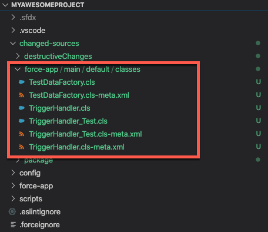

<!-- markdownlint-disable MD040 MD041 -->

[](https://scolladon.github.io/sfdx-git-delta/dev/bench/)
[](https://badgen.net/npm/v/sfdx-git-delta)
[](https://codeclimate.com/github/scolladon/sfdx-git-delta/maintainability)
[](https://codecov.io/gh/scolladon/sfdx-git-delta)
[](https://snyk.io//test/github/scolladon/sfdx-git-delta?targetFile=package.json)
[](https://badgen.net/npm/dw/sfdx-git-delta)


<br />
<div align="center">  
  
  <h1 align="center">SFDX-Git-Delta </h1>

  <p align="center">
    SFDX plugin to generate Incremental Salesforce deployments manifests and artifacts
    <br />
    <button href="https://github.com/scolladon/sfdx-git-delta/issues/new?assignees=scolladon&labels=bug&template=issue.md">Report Bug</button>
    ·
    <button href="https://github.com/scolladon/sfdx-git-delta/issues/new?assignees=scolladon&labels=enhancement&template=enhancement.md">Request Feature</button>
    ·
    <button href="https://github.com/sponsors/scolladon">Become a Sponsor</button>
  </p>
</div>

> [!WARNING]
> **Potentially breaking changes in v6**: Check out the [v6 migration guide](docs/migrating-to-v6.0.0.md) to see how you could be impacted by some changes in the new major `v6` version of the plugin, and how to migrate to this version.

<!-- TABLE OF CONTENTS -->
<details>
  <summary>Table of Contents</summary>

- [TL;DR](#tldr)
- [What is SFDX-Git-Delta?](#what-is-sfdx-git-delta)
- [Is SGD for you?](#is-sgd-for-you)
- [Getting Started](#getting-started)
  - [Prerequisites](#prerequisites)
  - [Installation](#installation)
- [How to use it?](#how-to-use-it)
- [`sf sgd source delta`](#sf-sgd-source-delta)
  - [Windows users](#windows-users)
  - [CI/CD specificity](#cicd-specificity)
  - [Git LFS support](#git-lfs-support)
  - [Use cases](#use-cases)
- [Walkthrough](#walkthrough)
  - [Execute sgd](#execute-sgd)
  - [Deploy the delta metadata](#deploy-the-delta-metadata)
- [Advanced use-cases](#advanced-use-cases)
  - [Test Changes Without Committing](#test-changes-without-committing)
  - [Generate a folder containing only the added/modified sources](#generate-a-folder-containing-only-the-addedmodified-sources)
  - [Exclude some metadata only from destructiveChanges.xml](#exclude-some-metadata-only-from-destructivechangesxml)
  - [Explicitly including specific files for inclusion or destruction regardless of diff](#explicitly-including-specific-files-for-inclusion-or-destruction-regardless-of-diff)
  - [Scoping delta generation to a specific folder](#scoping-delta-generation-to-a-specific-folder)
  - [Generate a comma-separated list of the added and modified Apex classes](#generate-a-comma-separated-list-of-the-added-and-modified-apex-classes)
  - [Condition deployment on package.xml and destructiveChange content](#condition-deployment-on-packagexml-and-destructivechange-content)
  - [Use the module in your own node application](#use-the-module-in-your-own-node-application)
  - [Handle flow deletion](#handle-flow-deletion)
- [Complementary Plugins](#complementary-plugins)
- [Changelog](#changelog)
- [Built With](#built-with)
- [Used by](#used-by)
- [Versioning](#versioning)
- [Authors](#authors)
- [Contributing](#contributing)
- [License](#license)
</details>

## TL;DR

```sh
sf plugins install sfdx-git-delta
```

```sh
sf sgd source delta --to "HEAD" --from "HEAD~1" --output-dir "."
```

```sh
sf project deploy start -x package/package.xml --post-destructive-changes destructiveChanges/destructiveChanges.xml
```

## What is SFDX-Git-Delta?

**SFDX-Git-Delta** (_a.k.a. **SGD**_) helps Salesforce Architects and Developers do 2 things with their source deployments:

- **Make deployments faster**: identify the changed metadata since a reference commit.

- **Automate destructive deployments**: build the destructiveChanges.xml from the deleted (or renamed) metadata

Have a look at this post on the Salesforce Developers Blog to dive into it: [Optimizing Unpackaged Deployments Using a Delta Generation Tool](https://developer.salesforce.com/blogs/2021/01/optimizing-unpackaged-deployments-using-a-delta-generation-tool.html).


## Is SGD for you?

If you are not a Salesforce Architect or Developer, probably not, _sorry_.

If you are a Technical Architect or Developer, then it’s a very useful tool for you, when meeting the 3 conditions below:

1. Your Salesforce project uses a git repo as the source of truth.
2. You use the Source (DX) format in the repo.
3. Your metadata is unmanaged (in other words, you are not building a managed or unlocked package).

SGD is designed to be part of a CI/CD pipeline (Jenkins, Bitbucket Pipelines, GitLab CI, GitHub Actions, Azure DevOps...) that handles the deployment of the sources to the Salesforce org(s).

Pro tip: Make sure your pipeline works **before** implementing incremental deployments. Otherwise, it will just make it harder to debug your pipeline.
It's also important to implement a way to switch back to full deployment in case the incremental deployment does not behave as expected.

**DISCLAIMER:**

**⚠️ SFDX-Git-Delta is NOT an officially supported tool ⚠️**

👷 Use it at your own risk, wear a helmet, and test it first before adding it to your pipeline 🔥

## Getting Started

### Prerequisites

The plugin requires git command line on the running environment.

**Node v20 or above is required**.
To check if Salesforce CLI runs under a supported node version for SGD, run `sf --version`. You should see a node version above v20 to use SGD.

If you encounter this issue whereas the node version is OK on the running environment, try to [install the Salesforce CLI via npm](https://developer.salesforce.com/docs/atlas.en-us.sfdx_setup.meta/sfdx_setup/sfdx_setup_install_cli.htm#sfdx_setup_install_cli_npm) (`npm install @salesforce/cli --global`).

### Installation

SGD is a Salesforce CLI plugin (`sf sgd source delta`). Run the following command to install it:

```sh
sf plugins install sfdx-git-delta
```

Because this plugin is not signed, you will get a warning saying: "This plugin is not digitally signed and its authenticity cannot be verified". This is expected, and you will have to answer `y` (yes) to proceed.

If you run your CI/CD jobs inside a Docker image, you can add the plugin to your image (such as in [this example](https://github.com/mehdicherf/sfdx-cli-gitlab)). If you use GitHub Actions, you can find some examples of using SGD [here](https://github.com/mehdicherf/sfdx-GitHub-actions/tree/main/.github/workflows).

## How to use it?

<!-- commands -->
* [`sf sgd source delta`](#sf-sgd-source-delta)

## `sf sgd source delta`

Generate incremental package manifest and source content

```
USAGE
  $ sf sgd source delta -f <value> [--json] [--flags-dir <value>] [-t <value>] [-d] [-o <value>] [-r <value>] [-s
    <value>...] [-i <value>] [-D <value>] [-n <value>] [-N <value>] [-W] [-a <value>]

FLAGS
  -D, --ignore-destructive-file=<value>   file listing paths to explicitly ignore for any destructive actions
  -N, --include-destructive-file=<value>  file listing paths to explicitly include for any destructive actions
  -W, --ignore-whitespace                 ignore git diff whitespace (space, tab, eol) changes
  -a, --api-version=<value>               salesforce metadata API version, default to sfdx-project.json
                                          "sourceApiVersion" attribute or latest version
  -d, --generate-delta                    generate delta files in [--output-dir] folder
  -f, --from=<value>                      (required) commit sha from where the diff is done
  -i, --ignore-file=<value>               file listing paths to explicitly ignore for any diff actions
  -n, --include-file=<value>              file listing paths to explicitly include for any diff actions
  -o, --output-dir=<value>                [default: ./output] source package specific output
  -r, --repo-dir=<value>                  [default: ./] git repository location
  -s, --source-dir=<value>...             [default: ./] source folders focus location relative to --repo-dir
  -t, --to=<value>                        [default: HEAD] commit sha to where the diff is done
      --ignore=<value>                    /!\ deprecated, use '--ignore-file' instead.
      --ignore-destructive=<value>        /!\ deprecated, use '--ignore-destructive-file' instead.
      --include=<value>                   /!\ deprecated, use '--include-file' instead.
      --include-destructive=<value>       /!\ deprecated, use '--include-destructive-file' instead.
      --output=<value>                    /!\ deprecated, use '--output-dir' instead.
      --repo=<value>                      /!\ deprecated, use '--repo-dir' instead.
      --source=<value>                    /!\ deprecated, use '--source-dir' instead.

GLOBAL FLAGS
  --flags-dir=<value>  Import flag values from a directory.
  --json               Format output as json.

DESCRIPTION
  Generate incremental package manifest and source content

  Use two git commit reference to generate the package corresponding to what has changed in between

EXAMPLES
  - Build incremental manifest from the previous commit
  $ sf sgd source delta --from "origin/development" --output-dir incremental
  - Build incremental manifest and source from the development branch
  $ sf sgd source delta --from "origin/development" --generate-delta --output-dir incremental

FLAG DESCRIPTIONS
  -a, --api-version=<value>

    salesforce metadata API version, default to sfdx-project.json "sourceApiVersion" attribute or latest version

    Override the api version used for api requests made by this command

  -s, --source-dir=<value>...  source folders focus location relative to --repo-dir

    You can use this flag multiple times to include different folders that contain source files. Each path should be
    relative to --repo-dir.

    The folder can exist or not.
    * If the folder exists, its contents will be processed.
    * If the folder doesn't exist, it usually won't show any output—unless the folder was recently deleted and is part
    of a diff, in which case changes may still be picked up.
```

_See code: [src/commands/sgd/source/delta.ts](https://github.com/scolladon/sfdx-git-delta/blob/main/src/commands/sgd/source/delta.ts)_
<!-- commandsstop -->

### Windows users

If you run SGD on a Windows system, use double quotes [to prevent the terminal to interpret parameters](https://github.com/scolladon/sfdx-git-delta/issues/134)

You should also avoid using the "^" character ([shorthand for parent commit in git](https://git-scm.com/docs/git-rev-parse#Documentation/git-rev-parse.txt-emltrevgtltngtemegemHEADv1510em)) because it is the [escape character in Windows](https://ss64.com/nt/syntax-esc.html#:~:text=include%20the%20delimiters.-,Escape%20Character,-%5E%20%20Escape%20character.).
So instead of:
```sh
sf sgd source delta --from "HEAD^" # wrong git shortcut with windows because it uses "^" syntax
````
You should write:
```sh
sf sgd source delta --from "HEAD~1" # right git shortcut with windows because it does not use "^", it uses "~n" syntax
```

### CI/CD specificity

In CI/CD pipelines, for most of the CI/CD providers, the checkout operation fetches only the last commit of the branch currently evaluated.
You need to fetch all the needed commits as the plugin needs access to the branch being compared.
Example for Github action checkout [here](https://github.com/actions/checkout#fetch-all-history-for-all-tags-and-branches).
If you use `-n` (`--include-file`) with metadata contained inside files you will need to have the full repo locally for the command to fully work.

In CI/CD pipelines, branches are not checked out locally when the repository is cloned, so you must specify the remote prefix.
If you do not specify the remote in CI context, the git pointer check will raise an error (as the branch is not created locally).
This applies to both `--from` and `--to` parameters as they both accept git pointers.

Example comparing `HEAD` with a `development` branch when the CI clones the repository with `origin` set as reference to the remote:

```sh
sf sgd source delta --to "HEAD" --from "origin/development" --output-dir .
```

Use a global variable when you need to easily switch sgd version (`vX.X.X` format) or channel (`stable`, `latest`, `latest-rc`) in your pipeline, without having to commit a new version of your pipeline.

Example with [github action](https://docs.github.com/en/actions/learn-github-actions/variables#using-the-vars-context-to-access-configuration-variable-values), [create a variable](https://docs.github.com/en/actions/learn-github-actions/variables#creating-configuration-variables-for-a-repository) SGD_VERSION and use it in the plugin installation phase

```yaml
- name: Install SGD
  run: echo y | sf plugins install "sfdx-git-delta@${{ vars.SGD_VERSION }}"
```

### Git LFS support

The plugin is compatible with git LFS.
It can read content from LFS locally.
It is the user responsibility to ensure LFS content is present when the plugin is executed.
⚠️ The plugin **will not fetch** content from the LFS server ⚠️

### Use cases

Any git sha pointer is supported: commit sha, branch, tag, git expression (HEAD, etc.).

`--from` parameter is the base commit (the first, the oldest, the closest)
`--to` parameter is the target commit (the last, the youngest, the farthest)
If you want to deploy incrementally the content of a PR, `--from` parameter will be the base branch the PR branch wants to merge to, and `--to` parameter will be the PR branch.

Here are examples of how to compare the content of different branches:

- **Comparing between commits in different branches**
  For example, if you have commit `fbc3ade6` in branch `develop` and commit `61f235b1` in branch `main`:

```sh
sf sgd source delta --to fbc3ade6 --from 61f235b1 --output-dir .
```

- **Comparing branches (all changes)**
  Comparing all changes between the `develop` branch and the `main` branch:

```sh
sf sgd source delta --to develop --from main --output-dir .
```

- **Comparing branches (from a common ancestor)**
  To compare the `develop` branch since its common ancestor with the `main` branch (i.e. ignoring the changes performed in the `main` branch after `develop` creation):

```sh
sf sgd source delta --to develop --from $(git merge-base develop main) --output-dir .
```

## Walkthrough

Consider the following scenario:

> **_The CI pipeline deploys the sources to Production anytime there is a new commit in the main branch._**

In our example, the latest commit to main is composed of:

- _Apex Class added:_ TriggerHandler
- _Apex Class added:_ TriggerHandler_Test
- _Apex Class modified:_ TestDataFactory
- _Apex Class deleted:_ AnotherTriggerFramework


In this situation, we would expect the CI pipeline to:

1. **Deploy to Production only 3 classes** (no matter how much metadata is present in the force-app folder): `TriggerHandler`, `TriggerHandler_Test`, and `TestDataFactory`
2. **Delete from Production 1 class**: `AnotherTriggerFramework`

So let’s do it!

### Execute sgd

From the project repo folder, the CI pipeline will run the following command:

```sh
sf sgd source delta --to "HEAD" --from "HEAD~1" --output-dir .
```

which means:

> Analyze the difference between HEAD (latest commit) and HEAD~1 (previous commit), and output the result in the current folder.

The `sf sgd source delta` command produces 2 useful artifacts:

**1) A `package.xml` file, inside a `package` folder.** This `package.xml` file contains just the added/changed metadata to deploy to the target org.

_Content of the `package.xml` file in our scenario:_


**2) A `destructiveChanges.xml` file, inside a `destructiveChanges` folder.** This `destructiveChanges.xml` file contains just the removed/renamed metadata to delete from the target org. Note: the `destructiveChanges` folder also contains a minimal package.xml file, because deploying destructive changes requires a package.xml (even an empty one).

_Content of the `destructiveChanges.xml` file in our scenario:_


Note: it is also possible to generate a **source** folder containing added/changed metadata with the [`--generate-delta (-d)`](#scoping-delta-generation-to-a-specific-folder) parameter. See the "Advanced use-cases" section for more examples.

### Deploy the delta metadata

The simplest option to deploy the incremental changes is to use `force:source:deploy` command with `-x` parameter:

```sh
sf project deploy start -x package/package.xml --post-destructive-changes destructiveChanges/destructiveChanges.xml
```

And voilà! 🥳

However, keep in mind that the above command will fail if the destructive change was supposed to be executed before the deployment (i.e. as `--pre-destructive-changes`), or if a warning occurs during deployment. Make sure to protect your CI/CD pipeline from those scenarios, so that it doesn't get stuck by a failed destructive change.

If needed, you can also split the added/modified metadata deployment from the deleted/renamed metadata deployment, as in the below examples:

Use the `package/package.xml` file to deploy only the added/modified metadata:

```sh
echo "--- package.xml generated with added and modified metadata ---"
cat package/package.xml
echo
echo "---- Deploying added and modified metadata ----"
sf project deploy start -x package/package.xml
```

Use the `destructiveChanges` folder to deploy only the destructive changes:

```sh
echo "--- destructiveChanges.xml generated with deleted metadata ---"
cat destructiveChanges/destructiveChanges.xml
echo
echo "--- Deleting removed metadata ---"
sf project deploy start --pre-destructive-changes destructiveChanges/destructiveChanges.xml --manifest destructiveChanges/package.xml --ignore-warnings
```

## Advanced use-cases

### Test Changes Without Committing

To check changes that aren't committed yet:

1. Make a temporary commit:
```sh
git add '<files>'
git commit -m 'temp: testing changes'
```

2. Run SGD:
```sh
sf sgd source delta --from <sha-pointer>
```

3. Undo the temporary commit while keeping your changes:
```sh
git reset --soft HEAD~1
```

Tip: For extra safety, do this in a temporary branch.
 
### Generate a folder containing only the added/modified sources

Using a package.xml for deployment is the simplest approach to delta deployments. But in some cases you may want to have only the actual recently changed source files.

One example is to speed up object deployments: the package.xml approach will deploy the entire sub-folder for a given object. Having a copy of the actual sources added/modified allows you to deploy only those components.

This is where the `--generate-delta (-d)` option comes handy!

Let's use this option with our previous example:

```sh
mkdir changed-sources
sf sgd source delta --to "HEAD" --from "HEAD~1" --output-dir changed-sources/ --generate-delta
```

It generates the `package` and `destructiveChanges` folders, and copies added/changed files in the output folder.

_Content of the output folder when using the --generate-delta option, with the same scenario as above:_



> ⚠️ Use `--generate-delta (-d)` when `--to (-t)` value is set to "HEAD" or to the "HEAD commit SHA".
> If you need to use it with `--to (-t)` pointing to another commit than "HEAD", checkout that commit first. Example:
>
> ```sh
> # move HEAD to the wanted past commit
> $ git checkout <not-HEAD-commit-sha>
> # You can omit --to, it will take "HEAD" as default value
> $ sf sgd source delta --from "HEAD~1" --output-dir changed-sources/ --generate-delta
> ```

Then it is possible to deploy the `change-sources` folder using `force:source:deploy` command with `-p` parameter:

```sh
sf project deploy start -p change-sources
```

### Exclude some metadata only from destructiveChanges.xml

The `--ignore-file [-i]` parameter allows you to specify an [ignore file](https://git-scm.com/docs/gitignore) to filter the
element on the diff to ignore. SGD ignores every diff line matching the pattern from the ignore file specified in the `--ignore-file [-i]`. `package.xml` generation, `destructiveChanges.xml` generation and `--delta-generate` will ignore those lines.

Sometimes you may need to have two different ignore policies. One for the `package.xml` and another one for `destructiveChanges.xml` files. This is where the `--ignore-destructive-file [-D]` option comes handy!
Use the `--ignore-destructive-file` parameter to specify a dedicated ignore file to handle deletions. It will apply to metadata listed in the `destructiveChanges.xml`. In other words, this will override the `--ignore-file [-i]` parameter for deleted items.

Consider the following:

- a repository containing many sub-folders (force-app/main, force-app/sample, etc)
- a commit deleting the Custom\_\_c object from one folder and modifying the Custom\_\_c object from another folder. This is a Modification and a Deletion events.

The Custom\_\_c object appears in the `package.xml` and in `destructiveChanges.xml` and fail the deployment. This is a situation where your may want to use the `--ignore-destructive-file [-D]` parameter! Add the Custom\_\_c object pattern in an ignore file and pass it in the CLI parameter:

```sh
# destructiveignore
*Custom\_\_c.object-meta.xml

$ sf sgd source delta --from commit --ignore-destructive-file destructiveignore

```

Note: when only using the `--ignore-file [-i]` parameter (and not `--ignore-destructive-file [-D]`) the plugin will apply it to added/changed/deleted elements.

### Explicitly including specific files for inclusion or destruction regardless of diff

The `--include-file [-n]` parameter allows you to specify a file based on [gitignore glob matching](https://git-scm.com/docs/gitignore) to include specific files. Regardless whether they appears in the diff or not.
Like the `--ignore-file` flag, this file defines a list of glob file matchers to always include `git` aware files in the `package.xml` package.
SGD will include every metadata from the repo at the `to` parameter state, matching the pattern from the include file specified in the `--include-file [-n]`.

As with `--ignore-file`, you may need different policies for the `package.xml` and `destructiveChanges.xml` files. This is where the `--include-destructive-file [-N]` option comes handy!

Use the `--include-destructive-file` parameter to specify a dedicated include file to handle deletions. Related metadata will appear in the `destructiveChanges.xml` output.

/!\ In order to work properly with metadata contained inside files (Labels, Workflow, MatchingRules, etc) the local repo must have the full historic.

Consider the following:

- a repository containing many sub-folders (force-app/main,force-app/sample, etc)
- a CI/CD platform generating a `force-app/generated/foo` file the `source:deploy` command should not include.
  You can create a file with a line matching this new file and specify this file using the `--include-destructive-file [-N]` parameter.

```sh
# .destructiveinclude
*generated/foo

$ sf sgd source delta --from commit --include-destructive-file .destructiveinclude
```

The path matchers in includes file must follow [`gitignore`](https://git-scm.com/docs/gitignore#:~:text=The%20slash%20/%20is%20used%20as%20the%20directory%20separator.) spec and accept only unix path separator `/` (even for windows system).

### Scoping delta generation to specific folders

The `--source-dir [-s]` parameter allows you to specify one or more folders to focus on, making any other folders ignored.
It means the delta generation will only focus on the dedicated folders.

For example, consider a repository containing many sub-folders (force-app/packaged, force-app/unpackaged, etc).
This repository contains packaged (deployed via package) and unpackaged (deployed via CLI) sources.
You only want to apply delta generation for the `admin` and `ui` folder of the unpackaged sources.

```sh
$ tree
.
├── force-app
│   ├── packaged
│   │   └── classes
│   │       └── PackagedClass.cls
│   └── unpackaged
│       ├── admin
│       │   └── profile
│       │       └── Admin.profile-meta.xml
│       ├── legacy
│       │   └── classes
│       │       └── LegacyClass.cls
│       └── ui
│           └── lightningExperienceThemes
│               └── MyCustomTheme.lightningExperienceTheme-meta.xml
└── ...

# scope the delta generation only to the unpackaged folders
$ sf sgd source delta --from commit --source-dir force-app/unpackaged/admin --source-dir force-app/unpackaged/ui
```

> The ignored patterns specified using `--ignore-file [-i]` and `--ignore-destructive-file [-D]` still apply.
> The `--source-dir` path must be relative to the `--repo-dir` path

### Generate a comma-separated list of the added and modified Apex classes

Depending on your testing strategy, [you may want to generate a comma-separated list of the added and modified Apex classes](https://github.com/scolladon/sfdx-git-delta/issues/126). This list can feed the `sf project deploy start --testlevel RunSpecifiedTests` command, for example.
To cover this need, parse the content of the package.xml file produced by SGD using [yq](https://github.com/kislyuk/yq):

`xq . < package/package.xml | jq '.Package.types | [.] | flatten | map(select(.name=="ApexClass")) | .[] | .members | [.] | flatten | map(select(. | index("*") | not)) | unique | join(",")'`

### Condition deployment on package.xml and destructiveChange content

SGD does not always generate content in the package.xml (or destructiveChanges.xml). Sometimes the commit range contains changes only within files to ignore (using .sgdignore and `--i` parameter).
[Deploying empty package.xml can lead to deployment errors.](https://github.com/scolladon/sfdx-git-delta/issues/249)
To avoid starting a failing deployment, test files content before execution:

```sh
# run deploy command only if the generated package contains metadata
if grep -q '<types>' ./package/package.xml ; then
  echo "---- Deploying added and modified metadata ----"
  sf project deploy start -x package/package.xml
else
  echo "---- No changes to deploy ----"
fi
```

### Use the module in your own node application

If you want to embed sgd in your node application, install it as a dependency for your application

```sh
npm install sfdx-git-delta
```

Then use the JavaScript module

```js
// sample/app.js
import sgd from 'sfdx-git-delta'

const work = await sgd({
  to: '', // commit sha to where the diff is done. [default : "HEAD"]
  from: '', // (required) commit sha from where the diff is done. [default : git rev-list --max-parents=0 HEAD]
  output: '', // source package specific output. [default : "./output"]
  apiVersion: '', // salesforce API version. [default : latest]
  repo: '', // git repository location. [default : "."]
})

console.log(JSON.stringify(work))
/* {
 *   config: config,
 *   diffs: { package: {...}, destructiveChanges: {...} },
 *   warnings: []
 * }
 */
```

### Handle flow deletion

Deleting a flow cannot be done by adding the flow in the `destructiveChanges.xml` and deploy.
A [known issue](https://issues.salesforce.com/issue/a028c00000gAwixAAC/deletion-of-flow-metadata-through-destructive-changes-not-supported) exist to cover this feature.
Please do not assume committing a flow metadata deletion to the repo, and then run sgd will allow you to delete a flow.

We suggest to deal with flow deletion in one go by following those steps (it requires the `FlowDefinition` metadata which is not available in API `v44+`)
1. Set the `FlowDefinition` `activeVersionNumber` to `0`
2. List the `FlowDefinition` in a `package.xml`
3. List all the existing version of the `Flow` in a `destructiveChangesPost.xml` (can be fetch via SOQL using this query : `SELECT FlowDefinitionView.ApiName, VersionNumber, Status FROM FlowVersionView WHERE FlowDefinitionView.ApiName='<FLOW_API_NAME>'`)
4. Deploy this `FlowDefinition` with a `package.xml` and post delete all the `Flow` versions with a post `destructiveChangesPost.xml` 

Example to delete the Flow `Set_Account_Description` :
1. Set the `FlowDefinition` `activeVersionNumber` to `0`
```xml
<!--Set_Account_Description.flowDefinition-meta.xml-->
<?xml version="1.0" encoding="UTF-8"?>
<FlowDefinition xmlns="http://soap.sforce.com/2006/04/metadata">
    <activeVersionNumber>0</activeVersionNumber>
</FlowDefinition>
```

2. List the `FlowDefinition` in a `package.xml`

```xml
<!--package.xml-->
<?xml version="1.0" encoding="UTF-8"?>
<Package xmlns="http://soap.sforce.com/2006/04/metadata">
    <types>
        <members>Set_Account_Description</members>
        <name>FlowDefinition</name>
    </types>
    <version>61.0</version>
</Package>
```

3. List all the existing version of the `Flow` in a `destructiveChangesPost.xml`

```xml
<!--destructiveChangesPost.xml-->
<?xml version="1.0" encoding="UTF-8"?>
<Package xmlns="http://soap.sforce.com/2006/04/metadata">
    <types>
        <members>Set_Account_Description-1</members>
        <members>Set_Account_Description-2</members>
        <members>Set_Account_Description-...</members>
        <members>Set_Account_Description-n</members>
        <name>Flow</name>
    </types>
</Package>
```

4. Deploy this `package.xml`, `destructiveChangesPost.xml` and `FlowDefinition`
```sh
# add `--ignore-warnings` parameter if you listed a deleted Flow version in the destructiveChangesPost.xml
sf project deploy start -x package.xml --post-destructive-changes destructiveChangesPost.xml
```

## Complementary Plugins

These plugins have been designed to work with SGD:

- [apex-test-list](https://github.com/renatoliveira/apex-test-list) - Developer: [renatoliveira](https://github.com/renatoliveira) - This plugin determines the specified Apex tests by reading test annotations made anywhere inside your Apex classes. You can have this plugin scan the package.xml created by SGD to determine the required Apex tests to run during deployment.
- [apex-tests-git-delta](https://github.com/mcarvin8/apex-tests-git-delta) - Developer: [mcarvin8](https://github.com/mcarvin8) - This plugin determines the specified Apex tests by reading the commit messages in the commit range. You can use the same `--from` and `--to` commit hashes when using SGD and apex-tests-git-delta to determine the required Apex tests to run during deployment.

## Changelog

[changelog.md](CHANGELOG.md) is available for consultation.

## Built With

- [fast-xml-parser](https://github.com/NaturalIntelligence/fast-xml-parser) - Validate XML, Parse XML to JS/JSON and vise versa, or parse XML to Nimn rapidly without C/C++ based libraries and no callback
- [fs-extra](https://github.com/jprichardson/node-fs-extra) - Node.js: extra methods for the fs object like copy(), remove(), mkdirs().
- [ignore](https://github.com/kaelzhang/node-ignore#readme) - is a manager, filter and parser which implemented in pure JavaScript according to the .gitignore spec 2.22.1.
- [lodash](https://github.com/lodash/lodash) - A modern JavaScript utility library delivering modularity, performance & extras.
- [MegaLinter](https://megalinter.io) - Open-Source tool for CI/CD workflows that analyzes the consistency of your code, IAC, configuration, and scripts
- [simple-git](https://github.com/steveukx/git-js) - A light weight interface for running git commands in any node.js application.
- [xmlbuilder2](https://github.com/oozcitak/xmlbuilder2) - An XML builder for node.js.

## Used by 

-[sfdx-hardis](https://sfdx-hardis.cloudity.com/) Toolbox for Salesforce DX, by Cloudity & friends, natively compliant with most platforms and tools.

## Versioning

Versioning follows [SemVer](http://semver.org/) specification.

## Authors

- **Sebastien Colladon** - Developer - [scolladon](https://github.com/scolladon)
- **Mehdi Cherfaoui** - Tester - [mehdicherf](https://github.com/mehdicherf)

## Contributing

Contributions are what make the trailblazer community such an amazing place. I regard this component as a way to inspire and learn from others. Any contributions you make are **appreciated**.

See [contributing.md](CONTRIBUTING.md) for sgd contribution principles.

## License

This project license is MIT - see the [LICENSE.md](LICENSE.md) file for details
